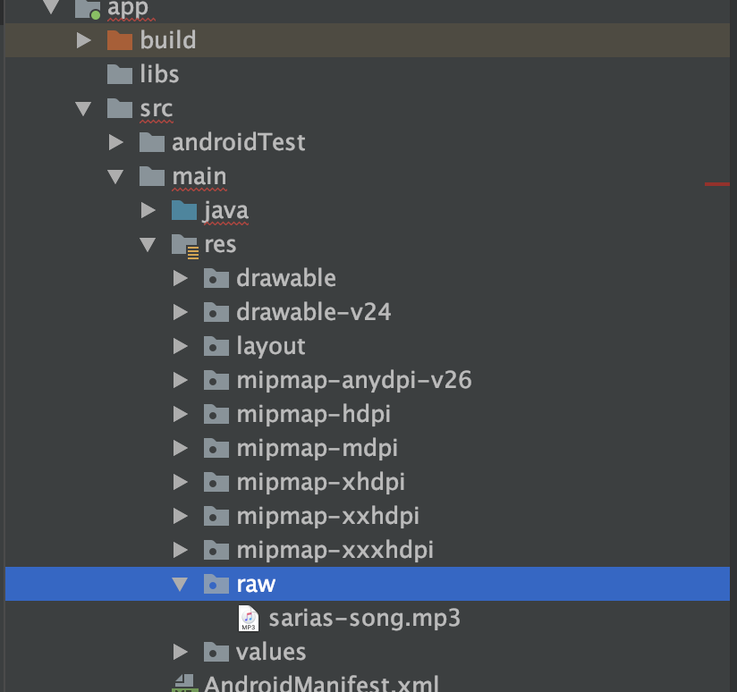

## Multimedia - Reproducción con MediaPlayer

### OBJETIVO

- Implementar por primera vez el objeto MediaPlayer 
- Reproducir un archivo de audio simple

#### REQUISITOS

1. Haber estudiado el Prework


#### DESARROLLO

1.- Abrir un nuevo proyecto con Activity vacía

2.- agregar el siguiente código en el archivo activity_main
```xml
<?xml version="1.0" encoding="utf-8"?>
<androidx.constraintlayout.widget.ConstraintLayout xmlns:android="http://schemas.android.com/apk/res/android"
    xmlns:app="http://schemas.android.com/apk/res-auto"
    xmlns:tools="http://schemas.android.com/tools"
    android:layout_width="match_parent"
    android:layout_height="match_parent"
    tools:context=".MainActivity">

    <Button
        android:id="@+id/btnPlay"
        android:layout_width="wrap_content"
        android:layout_height="wrap_content"
        android:background="#0000FF"
        android:text="Play ocarina"
        android:textColor="#FFFFFF"
        app:layout_constraintEnd_toStartOf="@+id/btnPause"
        app:layout_constraintStart_toStartOf="parent"
        app:layout_constraintTop_toTopOf="@+id/btnPause" />

    <Button
        android:id="@+id/btnPause"
        android:layout_width="wrap_content"
        android:layout_height="wrap_content"
        android:layout_marginTop="48dp"
        android:background="#00FF00"
        android:text="Pause song"
        android:textColor="#FFFFFF"
        app:layout_constraintEnd_toStartOf="@+id/btnStop"
        app:layout_constraintStart_toEndOf="@+id/btnPlay"
        app:layout_constraintTop_toTopOf="parent" />

    <Button
        android:id="@+id/btnStop"
        android:layout_width="wrap_content"
        android:layout_height="wrap_content"
        android:background="#FF0000"
        android:text="Stop playing"
        android:textColor="#FFFFFF"
        app:layout_constraintEnd_toEndOf="parent"
        app:layout_constraintStart_toEndOf="@+id/btnPause"
        app:layout_constraintTop_toTopOf="@+id/btnPause" />
</androidx.constraintlayout.widget.ConstraintLayout>
```

3.- En res, crear un nuevo directorio llamado Raw y agregar el audio incluído en este directorio.



4.- Vamos a crear una variable de instancia que almacene un objeto MediaPlayer, para poder reproducir el audio guardado en la app. Debe ser lateinit porque se inicializará después

```kotlin
private lateinit var mediaPlayer: MediaPlayer
```

5.- inicializamos mediaPlayer en el onCreate:

```kotlin
mediaPlayer = MediaPlayer.create(this, R.raw.sarias_song)
```

6.- Seteamos el listener del botón play, reproduciendo el audio si este no se está reproduciendo ya.

```kotlin
btnPlay.setOnClickListener{
            if(!mediaPlayer.isPlaying){ //Reproducimos sólo si no está en play
                mediaPlayer.start()
            }
        }
```

7.- Ahora delclaramos el listener del botón de pausa, ejecutando la acción únicamente si el audio se estaba reproduciendo (es redundante pausar un audio pausado).

```kotlin
btnPause.setOnClickListener{
            if(mediaPlayer.isPlaying){
                mediaPlayer.pause()
            }
        }
```

8.- Por último pausamos el audio si se estaba reproduciendo, y enviamos al segundo cero en la posición de tiempo. Al contrario de lo que se creería, el método stop hace una acción diferente.

```kotlin
btnStop.setOnClickListener{
            if(mediaPlayer.isPlaying){
                mediaPlayer.pause()
            }
            mediaPlayer.seekTo(0) //nos envía al segundo cero
        }
```

9.- Ejecuta la aplicación, debe de visualizarse algo similar a esto.


