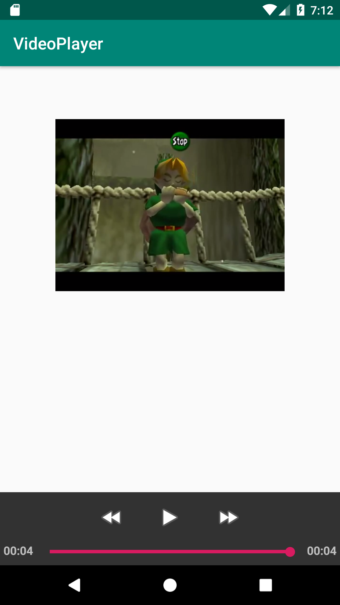

## Reproduccción de video

### OBJETIVO

- Reproducir un video previamente guardado dentro de los recursos.
- Agregar controles de video a la vista.

#### REQUISITOS

- Haber leído el tema de VideoView de la presentación en la sesión 1.

#### DESARROLLO

1.- Crear un proyecto con Activity vacía

2 .- Describir un widget VideoView en el layout de la actividad principal y dando de atributo un id específico. 

```kotlin
<?xml version="1.0" encoding="utf-8"?>
<androidx.constraintlayout.widget.ConstraintLayout xmlns:android="http://schemas.android.com/apk/res/android"
    xmlns:app="http://schemas.android.com/apk/res-auto"
    xmlns:tools="http://schemas.android.com/tools"
    android:layout_width="match_parent"
    android:layout_height="match_parent"
    tools:context=".MainActivity">

    <VideoView
        android:id="@+id/videoView"
        android:layout_width="330dp"
        android:layout_height="208dp"
        android:layout_marginTop="64dp"
        app:layout_constraintEnd_toEndOf="parent"
        app:layout_constraintStart_toStartOf="parent"
        app:layout_constraintTop_toTopOf="parent" />
</androidx.constraintlayout.widget.ConstraintLayout>
```
3.- Implementar el Video en el View. Se genera la ruta del vídeo por medio de una Uri local generada con el nombre de nuestro paquete y el archivo de video, ese video se setea en el videoView y se inicia con su método start().

```kotlin
val path = Uri.parse("android.resource://${packageName}/${R.raw.sarias_song}")

videoView.setVideoURI(path)
videoView.start()
```
4.- Corre el proyecto ¿Qué le falta a este? Existe un Control prefabricado para VideoViews llamado *MediaController*, este se ancla en la parte inferior de la Actividad, y contiene controles esenciales: Play/pause, atrás, adelante y una SeekBar. Para implementarla, hay que escribir lo siguiente: 

```kotlin
private lateinit var mc: MediaController

override fun onCreate(savedInstanceState: Bundle?) {
...
        mc =  MediaController(this)
        mc.setAnchorView(videoView)
        videoView.setMediaController(mc)
```

5.- Vamos ahora a mostrar un mensaje cuando el video finalizado, mediante el método *setOnCompletionListener*.
```kotlin
videoView.setOnCompletionListener {
            Toast.makeText(applicationContext,"Video finalizado!", Toast.LENGTH_SHORT).show()
        }
```

6.- Corremos la aplicación y vemos el vídeo.


