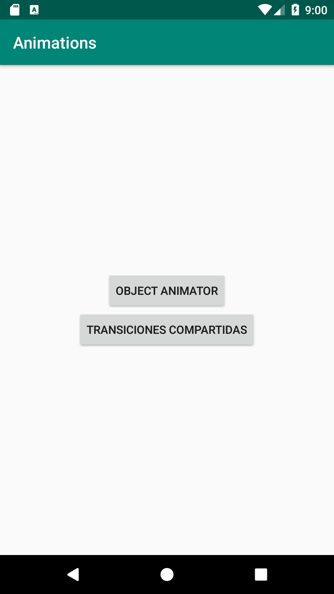
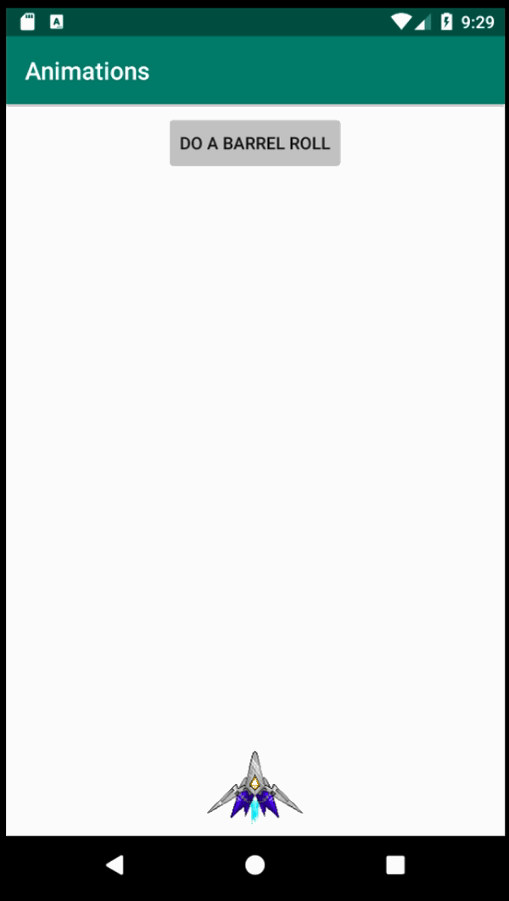
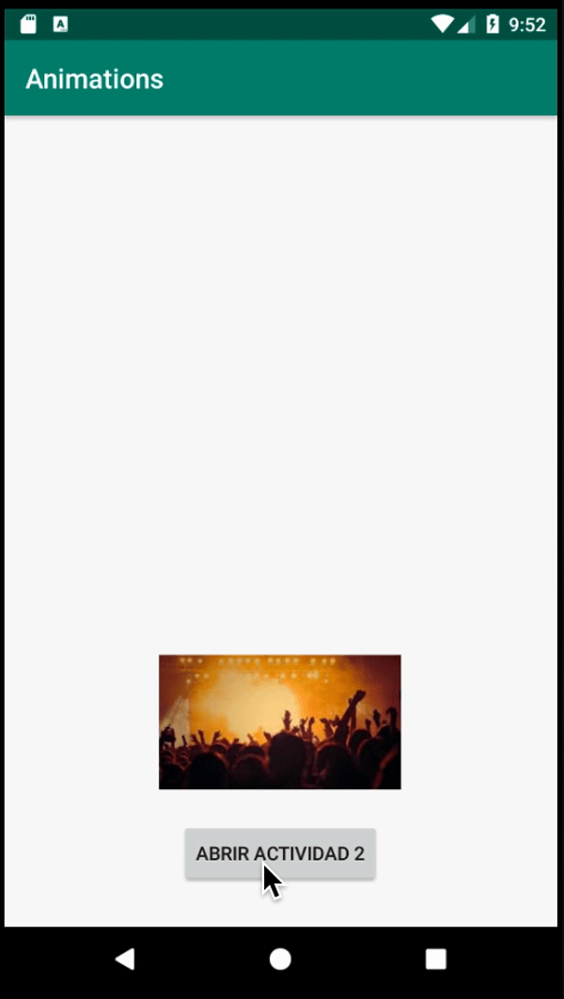

## Animaciones y Transiciones

### OBJETIVO

- Comprender el funcionamiento esencial de las animaciones en Android
- Aplicar conocimientos para generar nuestras propias animacionnes

#### REQUISITOS

1. Haber tomado la lección de Animaciones dentro de la presentación de la Sesión 01

#### DESARROLLO

Vamos a crear una pantalla principal que lleve a dos ejemplos distintos de animación: ValueAnimator y Transition.


1.- Creamos nuestra Activity principal similar a esta: 



2.- Cada botón debe llevar a una nueva actividad, no olvidar que eso se logra con un Intent con el siguiente Snippet:

```kotlin
val intent = Intent(this, <Nombre_de_la_clase>::class.java)
            startActivity(intent)
```

3.- Crear una Activiad para ensayar con ValueAnimator (en el ejemplo se nombró como ObjectAnimActivity), no olvidar crear su layout y declararla en el manifiesto.

4.- el layout de dicha clase consta de un FrameLayout (puede ser cualquier otro) y será clickable, un botón que generara una animación de rotación, y una imagen que será el objeto a animar:

```xml
<?xml version="1.0" encoding="utf-8"?>
<FrameLayout xmlns:android="http://schemas.android.com/apk/res/android"
    android:id="@+id/frameObjAnim"
    android:orientation="vertical" android:layout_width="match_parent"
    android:layout_height="match_parent">
    <Button
        android:id="@+id/btnBarrell"
        android:layout_width="wrap_content"
        android:layout_height="wrap_content"
        android:text="Do a barrel roll"
        android:layout_gravity="top|center"
        android:layout_marginTop="8dp"
        />
    <ImageView
        android:id="@+id/arwing"
        android:src="@drawable/arwing"
        android:layout_width="80dp"
        android:layout_height="80dp"
        android:layout_gravity="bottom|center"
        />
</FrameLayout>
```

5.- En la Actividad del layout anterior, no olvidar asignar en setContentView el layout correspondiente. Crear el método de traslación en Y para nuestra nave. Dividimos en pasos la animación para mayor comprensión:

- Obtenemos el centro del layout
- Creamos nuestro ValueAnimator con el rango de posición en Y que vamos a atravesar.
- Asignamos el nuevo valor de la posición de la nave en cada iteración del ValueAnimator
- Declaramos el interpolador del ValueAnimator
- definimos la duración de la animación en ms 
- corremos la animación

```kotlin
    //mover en el eje y a nuestra nave
    private fun moveArwing(){

       //obtenemos la posición del centro del layout
        val destination = - frameObjAnim.height / 2f

        //creando nuestro ValueAnimator, el rango del interpolador va de 0 a la mitad de la pantalla
        val valueAnimator = ValueAnimator.ofFloat(0f, destination)

        //cada update que del interpolador nos da el valor en el eje que necesitamos para setearlo en nuestra View
        valueAnimator.addUpdateListener {
            val value = it.animatedValue as Float //obtenemos el valor interpolado
            arwing.translationY = value //asignamos el valor interpolado en nuestra posición y
        }

        //declaramos al interpolador como uno lineal
        valueAnimator.interpolator = LinearInterpolator()

        //declaramos la duración de la animación en 1000 ms = 1 segundo
        valueAnimator.duration = 1000

        //corremos la animación
        valueAnimator.start()
    }
```

6.- Siguiendo los mismos pasos la instrucción anterior hacemos rotar nuestra nave:

```kotlin
 private fun barrelRoll(){
        //el valor de nuestro animator va del 0 a 720, dos veces 360º (dos rotaciones de 360º)
        val valueAnimator = ValueAnimator.ofFloat(0f, 720f)

        //en cada update del animador asignamos la rotación requerida
        valueAnimator.addUpdateListener {
            val value = it.animatedValue as Float //obteniendo el valor actual
            // 2
            arwing.rotation = value //asignando la posición de rotación
        }

        valueAnimator.interpolator = LinearInterpolator() //el interpolador es lineal
        valueAnimator.duration = 1000 //la duración es de 1 segundo
        valueAnimator.start() //correr la animaciónn
    }
```

7.- implementamos cada método a su correspondiente listener (el del botón para el *barrelRoll* y el del FrameLayout para *MoveArwing* ).
Tu vista debe quedar parecido a esto: 





8.- Ahora continuamos con la transición compartida, creamos un layout para nuestra nueva actividad que contenga una imagen y un botón. Nótese que en el ImageView vemos un atributo llamado transitionName con valor "header_transition".

```kotlin
<?xml version="1.0" encoding="utf-8"?>
<RelativeLayout xmlns:android="http://schemas.android.com/apk/res/android"
    android:layout_width="match_parent"
    android:layout_height="match_parent">

    <ImageView
        android:id="@+id/imgConcert"
        android:layout_width="180dp"
        android:layout_height="100dp"
        android:layout_alignParentBottom="true"
        android:layout_centerHorizontal="true"
        android:layout_marginBottom="102dp"
        android:scaleType="centerCrop"
        android:src="@drawable/concert"
        android:transitionName="header_transition" />

    <Button
        android:id="@+id/btnActivity2"
        android:layout_width="wrap_content"
        android:layout_height="wrap_content"
        android:layout_alignParentBottom="true"
        android:layout_centerHorizontal="true"
        android:layout_marginBottom="31dp"
        android:text="Abrir actividad 2" />

</RelativeLayout>
```

9.- Creamos la clase para nuestra Activity, en el listener de nuestro botón debemos agregar la siguiente línea de código: 

```kotlin
val intent = Intent(this, TransitionedActivity::class.java)

            //se obtiene el nombre de la transción para identificar nuestros diseños, crear las escenas
            //y la animación de la transición
            val options = ViewCompat.getTransitionName(imgConcert)?.let {
                ActivityOptionsCompat.makeSceneTransitionAnimation(
                    this, imgConcert, it
                )
            }
            startActivity(intent, options?.toBundle())
```

Aquí lo importante es esta línea de código: ***ActivityOptionsCompat.makeSceneTransitionAnimation(Context, View, transitionName)***, con esto podemos crear la transición de elementos, pasando la vista a transicionar y el nombre de su transición (que tendrán que ser compartidas con la vista destino).

10.- Creamos el layout para nuestra Actividad de Transición destino:

```xml
<?xml version="1.0" encoding="utf-8"?>
<LinearLayout xmlns:android="http://schemas.android.com/apk/res/android"
    android:layout_width="match_parent"
    android:layout_height="match_parent"
    android:orientation="vertical">
    <ImageView
        android:layout_width="match_parent"
        android:layout_height="250dp"
        android:scaleType="centerCrop"
        android:src="@drawable/concert"
        android:transitionName="header_transition" />

    <TextView
        android:layout_width="match_parent"
        android:layout_height="wrap_content"
        android:textSize="20sp"
        android:layout_marginTop="12dp"
        android:paddingHorizontal="12dp"
        android:text="Este texto aparece/desaparece por grado de transparencia debido a que de esa forma se definió en el TransitionedActivity" />

</LinearLayout>
```

Nótese que el ImageView de este layout también cuenta con el atributo transitionName y tiene el mismo valor que el layout de la actividad anterior.

11.- En la Activity destino, no es necesario hacer modificación alguna para que la transición compartida suceda, pero para ilustrar las transiciones de entrada y salida, insertamos esto en onCreate (que influirá sobre todas las vistas de esta actividad, en específico en el texto).

```kotlin
//definiendo el tipo de transición
        val fade = Fade()

        //asignando el tipo de transición a las transiciones de la ventana
        window.enterTransition = fade
        window.exitTransition = fade
```




