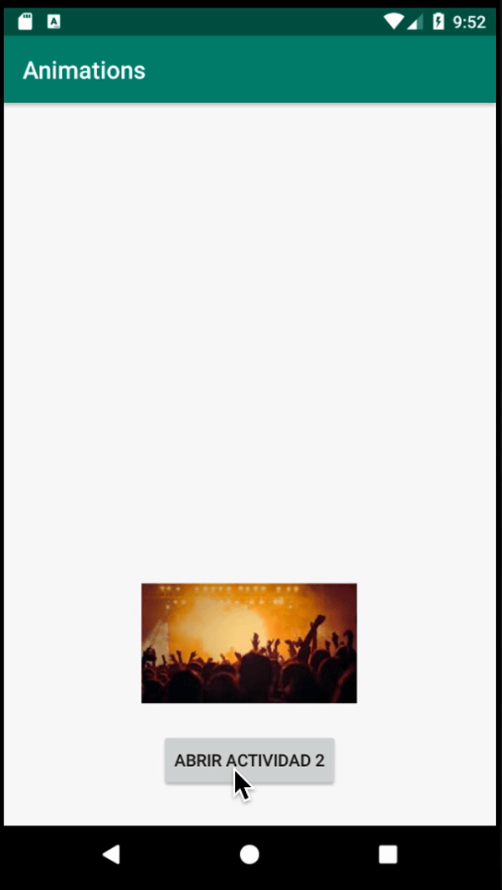

## POSTWORK

### OBJETIVO

- Implementar una transición vista en el ejemplo 3 para la tienda

#### REQUISITOS

1. Haber terminado el tercer ejemplo y su reto para el [Ejemplo 3](../Ejemplo-03) o el [Reto 3](../Reto-03)

2. Haber finalizado el [Postwork](../../Sesion-02/Postwork) de la [Sesión 2](../../Sesion-02)

#### DESARROLLO

Desarrollar cualquiera o las dos tareas listadas a continuación, Al dar click en algún producto de la lista:

* Deberemos crear una transición similar a esta con la imagen del producto:



* Animar la entrada y salida de nuevos elementos con este tipo de instrucción (tomar ejemplo del [Reto 3](../Reto-03) ):

```kotlin
window.enterTransition = Slide() 
```


