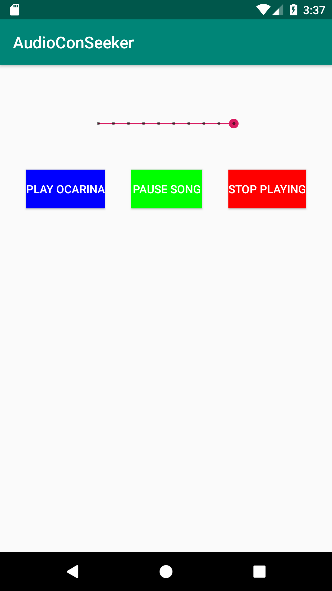

## Reproducción de audio

### OBJETIVO 

- Expandir el conocimiento de la clase MediaPlayer
- Implementar el View SeekBar

#### REQUISITOS 

1. Haber finalizado el [Ejemplo 01](/../../tree/master/Sesion-04/Ejemplo-01) de esta sesión.
2. 

#### DESARROLLO

Tomando el código del [ejemplo 01](/../../tree/master/Sesion-04/Ejemplo-01), se agregará una barra de progreso (SeekBar) capaz de mostrar el progreso de reproducción del audio y poder cambiar el segundo de reproducción.

1.- Implementar el View ***SeekBar*** en el layout de la actividad principal.

*Opcional*: agregarle el siguiente atributo (para darle mejor estética a este) 
>style="@style/Widget.AppCompat.SeekBar.Discrete"

2.- en el onCreate, setear la duración del audio a reproducir en el valor máximo del SeekBar.

3.- Modificar el tiempo en la reproducción del audio tomando el parámetro del SeekBar, utilizando el siguiente snippet: 

```kotlin
seekBar.setOnSeekBarChangeListener(object : SeekBar.OnSeekBarChangeListener {

            override fun onStopTrackingTouch(seekBar: SeekBar) {

            }

            override fun onStartTrackingTouch(seekBar: SeekBar) {

            }

            override fun onProgressChanged(seekBar: SeekBar, progress: Int, fromUser: Boolean) {
                //En la condicional, utilizar el booleano fromUser para verificar que la modificación fue porque el usuario lo realizó
                //TODO: Aquí va el código del paso 3
            }
        })
```

4.- Implementar el manejador en  para que el progreso del SeekBar se sincronice con el de la reproducción del audio. La implementación reside en la siguiente función.

```kotlin
private fun updateSeekBar(){
        val mHandler = Handler()

        //Actualizamos la información cada segundo en el hilo de la IU, que se ejecuta en el MainThread
        this@MainActivity.runOnUiThread(object : Runnable {

            override fun run() {
                // Aquí va el código
                mHandler.postDelayed(this, 1000) //correr cada segundo
            }
        })
    }
```


La pantalla debe quedar de la siguiente forma: 



##### Apéndice 

**Tabla con algunos de los métodos de la clase *MediaPlayer* **

| Método | Descripción  | return type  |
| :-----:| :----------: | :----------: |
| isLooping() | informa si el MediaPlayer está en loop o no | boolean |
| seekTo(int msec) | regresa el MediaPlayer al tiempo especificado | void | 
| pause() | pausa la reproducción | void |
| getCurrentPosition() | Obtiene la posición en tiempo actual de la reproducción | int | 
|isPlaying() | informa si el MediaPlayer se está reproduciendo | boolean |
| reset() | Resetea el MediaPlayer al estado *Uninitialized* | void |
| setLooping(boolean looping) | si true, repite la reproducción el archivo media al finalizarse | void |
| getDuration | obtiene la duración del archivo en milisegundos, (-1 si no se pudo obtener) | int |
