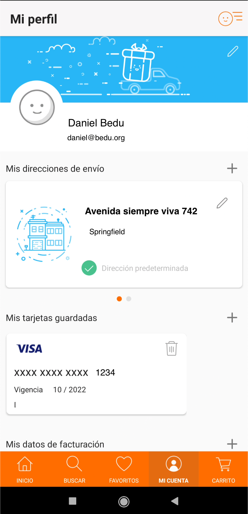

## Postwork

### OBJETIVO

- Implementar el consumo de algún web service a nuestra app

#### REQUISITOS

1. Haber cursado todos los ejercicos de la sesión 3

#### DESARROLLO

Aplicaremos el consumo de un servicio web para simular el inicio de sesión a través de una API de testing.

Para esto, nos apoyaremos de un sitio web que nos facilite la API, sugerimos usar [reqres](https://reqres.in/) y buscar el servicio de login que funciona con el método POST, probablemente requiera xxx-form-urlenconded pero no está confirmado (hacer pruebas con y sin la anotación), para ese caso, podría aplicar el siguiente código:

```kotlin
@FormUrlEncoded
@POST("login")
```

También debemos obtener los datos de perfil del usuario y desplegarlos en una *Activity*, se recomienda crear un *TabLayout* con todas las pantallas que vamos a mostrar en el menú principal y ahí colocar la pantalla de perfil, algo como la siguiente pantalla:



[Reqres](https://reqres.in/) falicita un web service para obtener un perfil:

https://reqres.in/api/users/[un-numero]


