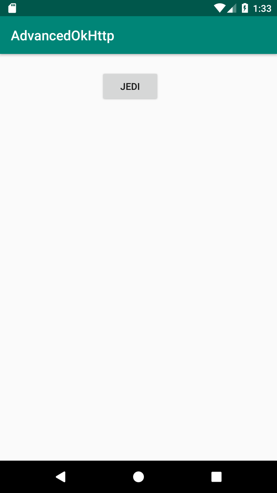

 ## OkHttp Avanzado

### OBJETIVO 

- Poner en práctica los conceptos aprendidos en el [Ejemplo 02](../Ejemplo-02)

#### REQUISITOS 

1. Haber cursado dicho tema en la exposición.
2. Haber finalizado el [Ejemplo 02](../Ejemplo-02)

#### DESARROLLO

Este proyecto es una adaptación del ejemplo 2.

Buscamos sólamente imprimir en consola el resultado de la lista entera de gente de star wars, pero con Gson.

por lo tanto, requerimos mostrar una pantalla así:



* El json tiene la siguiente estructura: 
```js
{
    ...
    "results": [
        {...},
	{...},
	]
```

por lo tanto, necesitamos una clase data que tenga dicha estructura.

**Recordar** que todo arreglo en un json puede ser representado con un ArrayList en Gson.

<details>

	<summary>Solución</summary>
	
```kotlin
package org.bedu.advancedokhttp

import com.google.gson.annotations.SerializedName

data class Jedi(
    val name: String? = "",
    val height: Int? = 0,
    val mass: Int? =0
)

data class JediList(
   @SerializedName("results") //el nombre real
    val jediList: ArrayList<Jedi>
)
```
	
</details>

