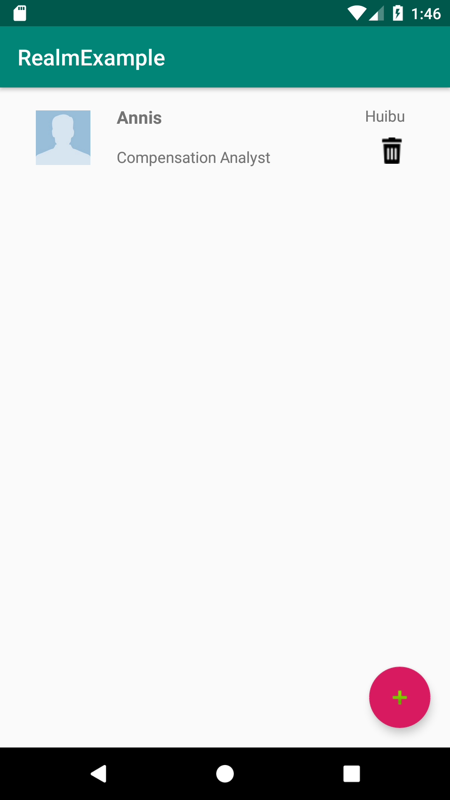
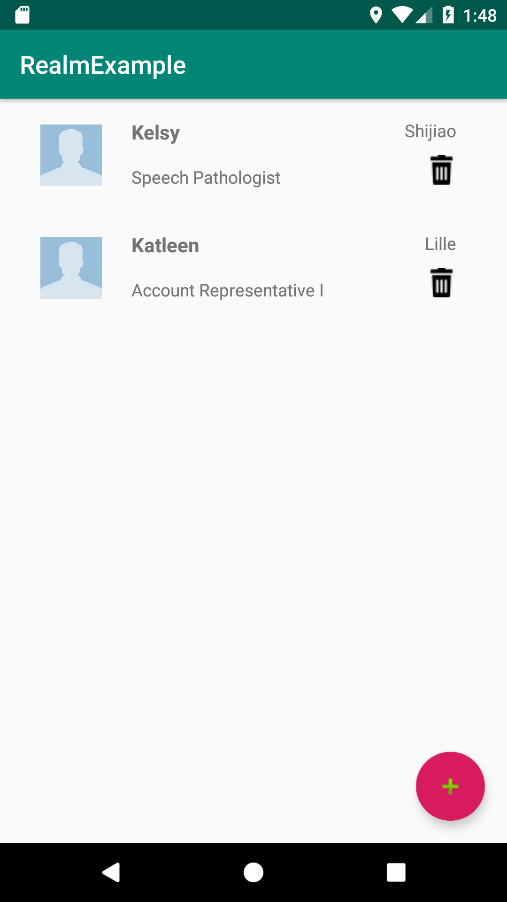
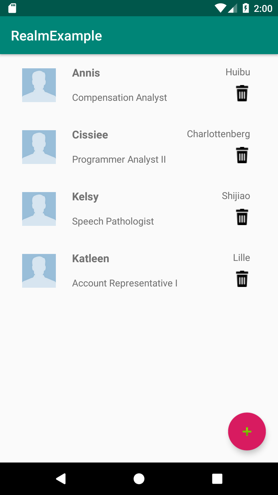
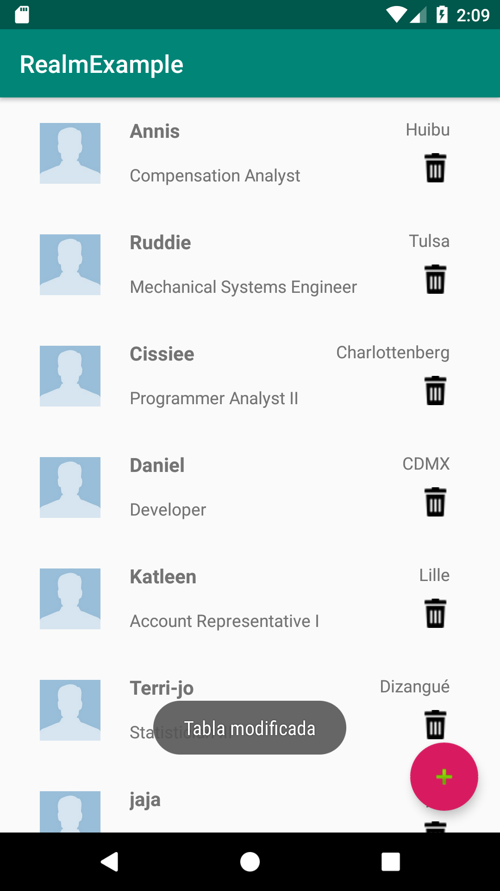

## Realm avanzado

### OBJETIVO

- Aprender a hacer queries filtradas en Realm
- Recibir notficaciones cuando cambie un Realm

#### REQUISITOS

1. Haber terminado la [Sesión 2](../../Sesión-02)
2. Haber tomado la lección 3 de la presentación

#### DESARROLLO

1. Bajamos la solución del [Reto 3](../Reto-03) de este repositorio como base y abrimos el proyecto

2. Vamos a jugar con la filtración de contactos. 

- En la función *onCreate()* del ***MainActivity***, vamos a añadir un método extra a la asignación de la variable *contacts* paraa obtener únicamente los contactos con nombre *"Annis"*. 

```kotlin
contacts = realm
            .where(Contact::class.java)
            .equalTo("name","Annis")
            .findAll()

```

Deberemos visualizar lo siguiente:



- Ahora Vamos a filtrar los nombres que comiencen con K:

```kotlin
contacts = realm
            .where(Contact::class.java)
            .beginsWith("name","K")
            .findAll()
```

Deberemos visualizar lo siguiente:



-Ahora vamos a mostrar los contactos que vivan en *Lille* o que su nombre contenga la letra *S*, para eso, haremos uso de *groups*:

```kotlin
contacts = realm
            .where(Contact::class.java)
            .beginGroup()
                .like("name", "*s*")
                .or()
                .equalTo("city", "Lille")
            .endGroup()
            .findAll()
```

Deberemos visualizar lo siguiente:



3. Ahora vamos a recibir notificaciones cada que exista una modificación en el *Realm*, primero, removemos los Toast de nuestro proyecto (uno al agregar nuevo contacto en *MainActivity* y otro en el *RecyclerAdapter*, en el clickListener de nuestra vista). Después delcaramos esta variable en nuestra clase:

```kotlin
private lateinit var realmListener : RealmChangeListener<Realm>
```

la seteamos en el onCreate de esta forma:

```kotlin
realm = Realm.getDefaultInstance()

//declaramos la notificación cada que cambia el Realm
realmListener =  RealmChangeListener{
       Toast.makeText(this,"Tabla modificada",Toast.LENGTH_SHORT).show()
}
//suscribimos a nuestra instancia de Realm
realm.addChangeListener(realmListener)
```

y cerramos el listener junto con el *Realm* (**EL REALM SIEMPRE SE DEBE CERRAR**)

```kotlin
override fun onDestroy() {
        super.onDestroy()

        realm.removeChangeListener(realmListener)
        realm.close()
    }
```

la notificación se mostrará así:


