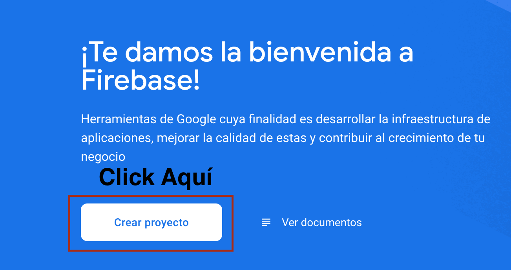
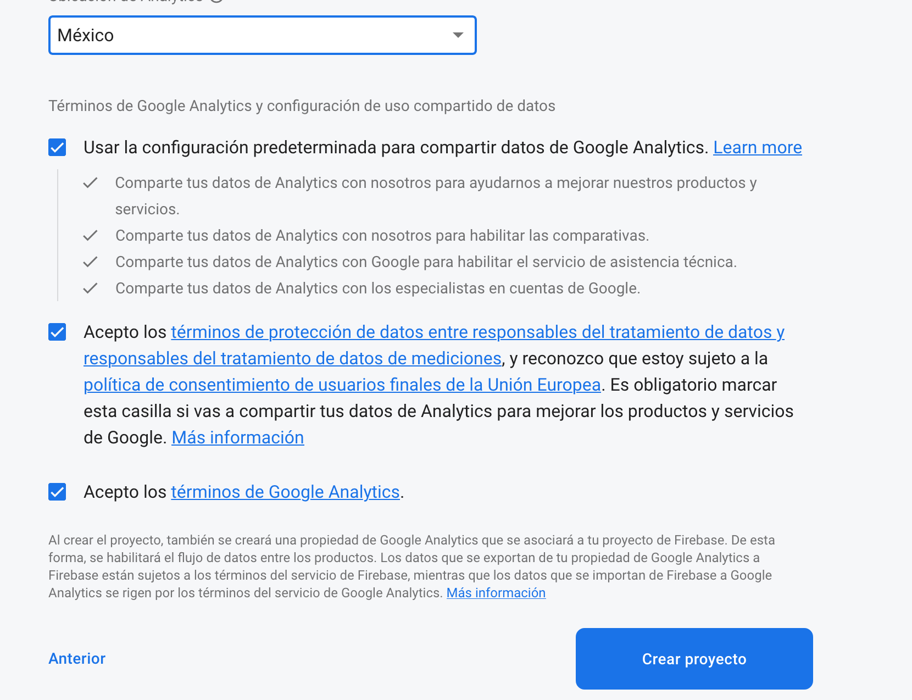
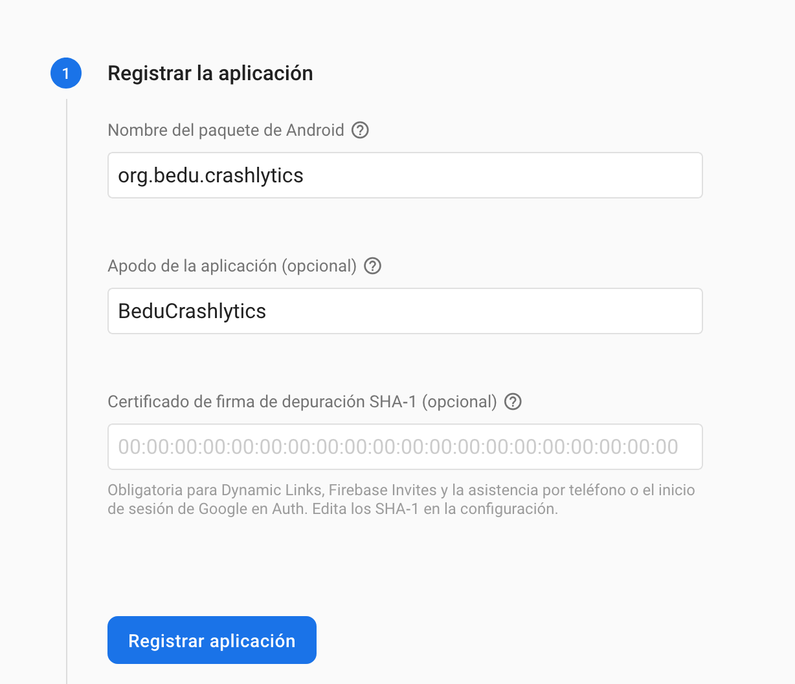
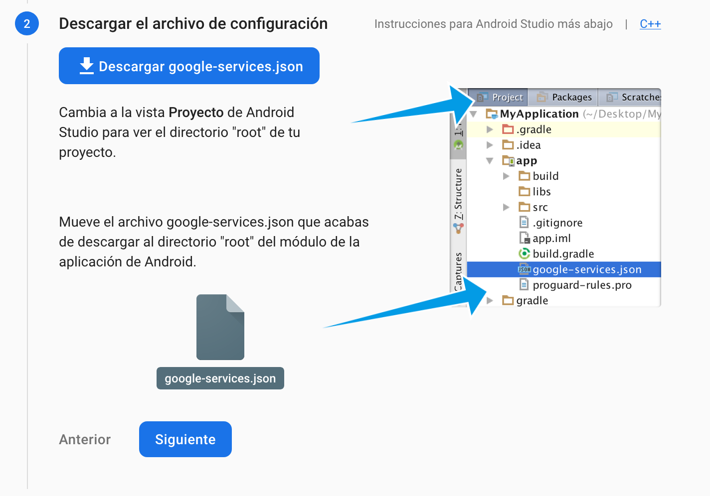
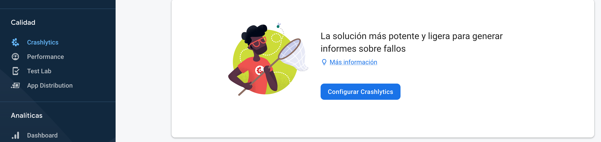
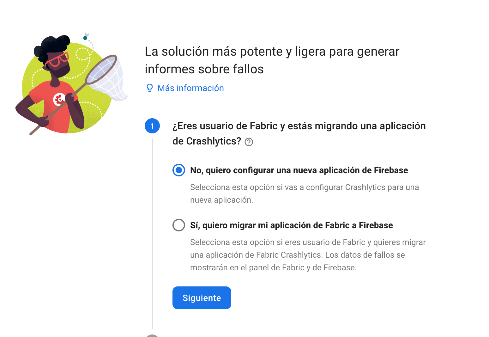
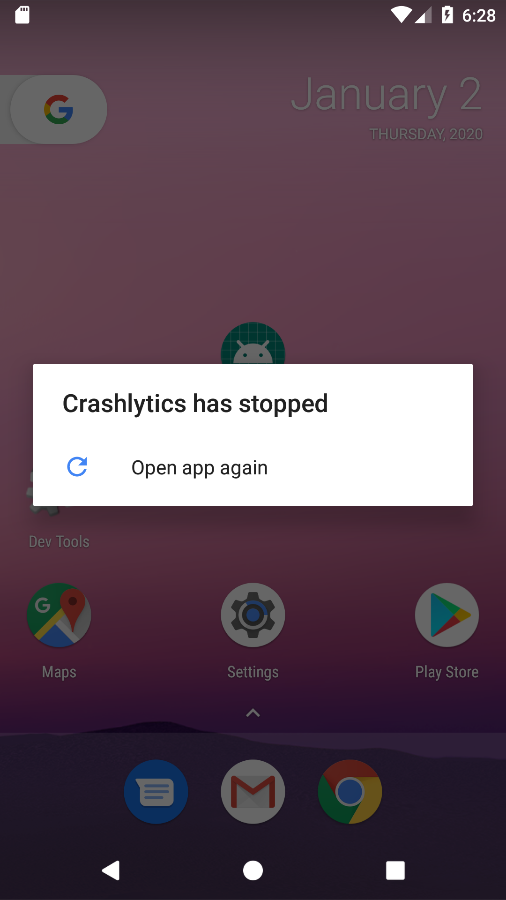

## Crashlytics - primeros pasos

### OBJETIVO

- Conocer a nivéles muy básicos firebase
- Instalar Crashlytics
- Hacer las primeras pruebas 

#### REQUISITOS

1. Leer previamente el prework
2. Comprender el primer tema de la sesión 5

#### DESARROLLO

Antes de instalar y aplicar Crashlytics, debemos configurar un proyecto en la Firebase console. Para esto seguiremos los siguientes pasos:

a) Abriremos la [Firebase Console](https://console.firebase.google.com/?hl=es) con una cuenta google que poseamos y crearemos un proyecto nuevo.


b) Asignamos un nombre (en este caso, le llamaremos BeduPracticas)

c) Aceptaremos Google Analytics 


d) Seleccionamos México como *Ubicación de Analytics*, aceptaremos todos los términos y click en *Crear proyecto*



e) En la pantalla de inicio del proyecto, buscar el ícono de android y dar click sobre él


f) Registrar el nombre del paquete de la aplicación y su nick



g) Descargar el archivo *google-services.json* y moverlo a la carpeta app del proyecto, como se indica en la imagen



h) Ignorar los siguientes pasos del sitio, estos se cubrirán en los pasos de abajo.

i) Ahora, con nuestra aplicación en el proyecto, iremos a la barra izquierda y daremos click en Crashlytics, daremos en siguiente para todas las instrucciones






Vamos a comenzar instalando lo necesario para hacer funcionar Crashlytics

1. Abrir el archivo *build.gradle* que está en la raíz de nuestro proyecto.

2. Copiar los repositorios necesarios tal como se muestra a continuación:

```kotlin
buildscripts {
    repositories {
        // ...
        google() //si no estaba, agregarlo
        maven {
           url 'https://maven.fabric.io/public'
        }
    }

    dependencies {
        // ...
         classpath 'com.google.gms:google-services:4.3.3'  // plugin de Google Services
         classpath 'io.fabric.tools:gradle:1.31.2' //el plugin de crashlytics
    }
}

allprojects {
    // ...
    repositories {
       // ...
       google() //si no estaba, agragarlo
    }
}

```

2. Abrir *app/build.gradle* y aplicar el plugin de fabric después del plugin *com.android.application*:

```kotlin
apply plugin: 'com.android.application'

apply plugin: 'io.fabric'
```

3. En el mismo archivo, agregar la dependencia de crashlytics 

```kotlin
implementation 'com.google.firebase:firebase-analytics:17.2.1' // Opcional, pero la agregaremos
implementation 'com.crashlytics.sdk.android:crashlytics:2.10.1' // Dependencia de crashlytics
```

4. Agregar al fondo de *app/build.gradle* 
```kotlin
apply plugin: 'com.google.gms.google-services'
```

5. Sincronizar proyecto y correr 

6. Vamos a provocar nuestro primer error. En el arcchivo *activity_main.xml*, crear un botón para generar el crash

```xml
...
    <Button
        android:id="@+id/btnError"
        android:layout_width="wrap_content"
        android:layout_height="wrap_content"
        android:text="Provocar error"
        app:layout_constraintBottom_toBottomOf="parent"
        app:layout_constraintLeft_toLeftOf="parent"
        app:layout_constraintRight_toRightOf="parent"
        app:layout_constraintTop_toTopOf="parent" />
...
```
7. Setear el click listener del botón para generar el error en el *MainActivity*:

```kotlin
 btnError.setOnClickListener{
            Crashlytics.getInstance().crash()
        }
```

8. Correr y pulsar el botón, la aplicación debe crashear y mostrar un mensaje similar a este: 



9. Refresca el panel de crashlytics! deberá salir un *Bloqueo* (ese es el error que provocamos).


