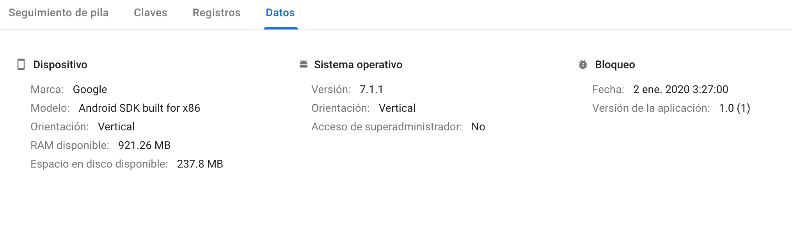
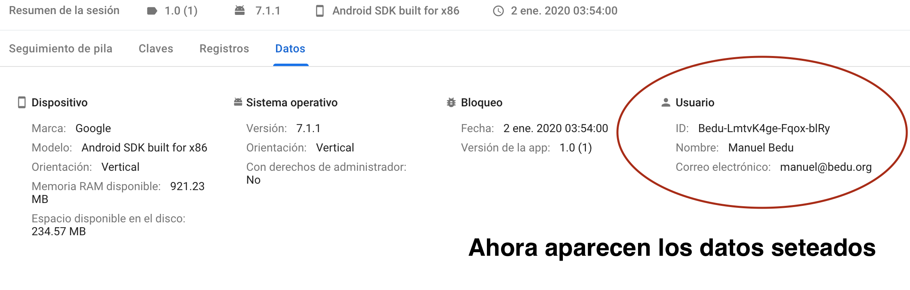
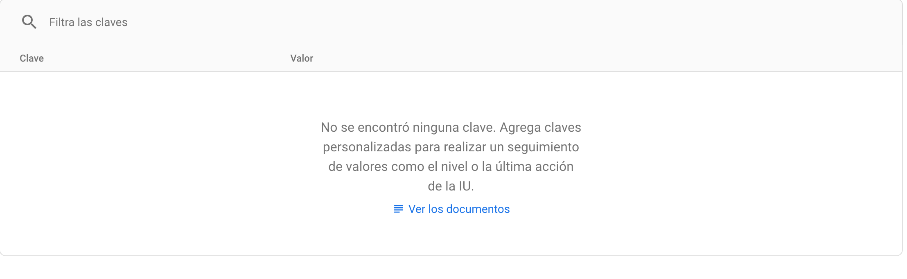
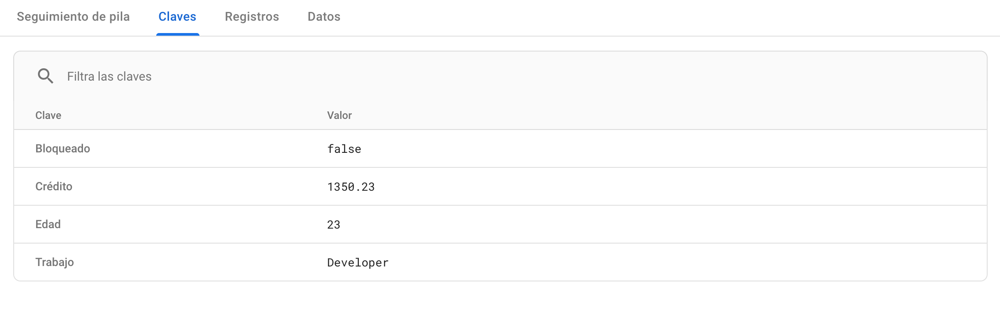

## Crashlytics - siguientes pasos

### OBJETIVO

- Enriquecer la experiencia con crashlytics

#### REQUISITOS

1. Haber cursado el [Reto 1](../Reto-01)
2. Haber leído el prework

#### DESARROLLO

Anteriormente pudimos ver cómo generar un propio error lanzando una excepción,Ahora vamos a agregar datos extra del usuario.

Tomamos de base el proyecto del [Reto 1](../Reto-01) para comenzar:

este es la pestaña de datos del último registro hecho en el [Reto 1](../Reto-01), donde se pueden apreciar que los datos que aparecen son del dispositivo, pero no tienen info personal.



1. vamos a agregar los siguientes datos:
        -Correo electrónico
        -UID
        -Nombre de usuario
        
con los siguientes métodos, llamados en el onCreate: 

```kotlin
Crashlytics.setUserIdentifier("Bedu-LmtvK4ge-Fqox-blRy")
Crashlytics.setUserEmail("manuel@bedu.org")
Crashlytics.setUserName("Manuel Bedu")
```
2. Esperamos un momento y consultamos el dashboard de Crashlytics, abrimos el último registro y abrimos la pesataña *datos*:




3. En el anterior error, al entrar a la pestaña de Claves, podemos observar que el log está vacío:



Pondremos ahora valores clave a los errores, llamando a los siguientes métodos en el *onCreate*:

```kotlin
Crashlytics.setInt("Edad", 23)
Crashlytics.setString("Trabajo", "Developer")
Crashlytics.setBool("Bloqueado",false)
Crashlytics.setFloat("Crédito",1350.23f)
```

corremos la aplicación y volvemos a generar el error. Consultamos el log y nos vamos a la pestaña *Claves*, debería salir un log similar al siguiente:




