## Configuraciones adicionales

### OBJETIVO

- Conocer las configuraciones y características adicionales que brinda Crashlytics

#### REQUISITOS

1. Haber finalizado los ejercicios anteriores

#### DESARROLLO

Los siguientes son ejercicios finales para terminar de comprender el uso del dashboard de Crashlytics.

##### Activar correo de aviso

1. Vamos a activar un correo de aviso cuando se genere un nuevo error. Para ello, tenemos qué dar click a la campana en la pantalla superior derecha (estando en el dashboard de Crashlytics).

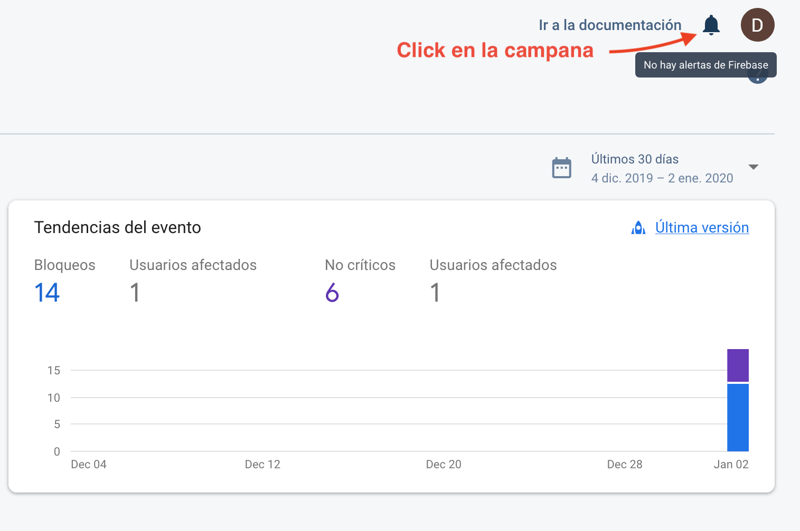

2. Se desplegará un menú lateral, Dar click al enlace *Manage your alerts for this project*.

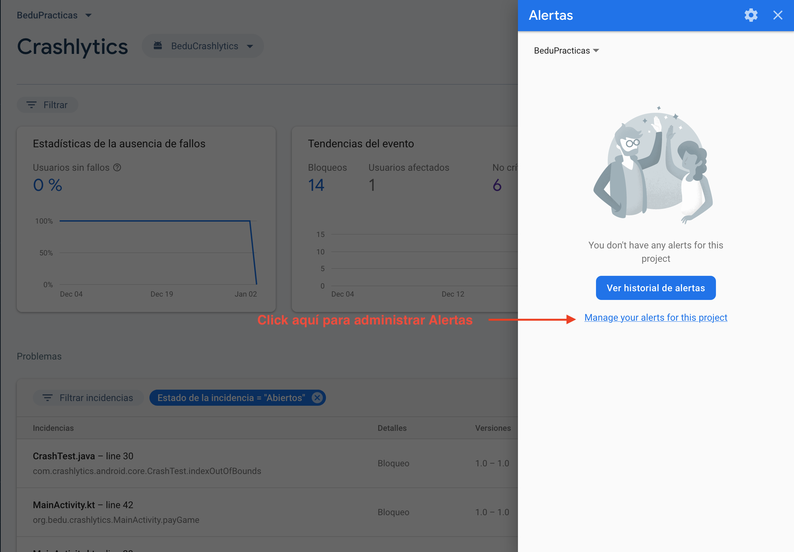

3. Se abrirá una nueva ventana con opciones de alerta para varios servicios, buscar Crashlytics y activar las casillas restantes (para nuevos errors urgentes y no urgentes).

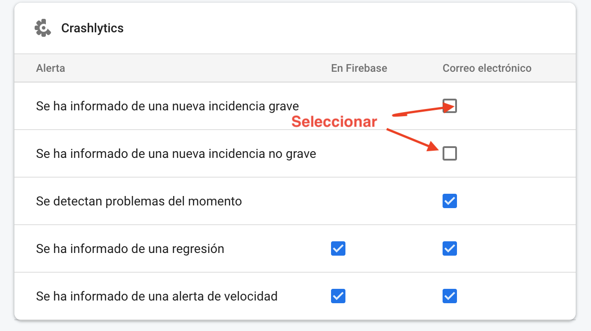

4. Abrir El [Ejemplo 2](../Ejemplo-02) y mover un par de líneas de código el error generado por nosotros (para que Crashlytics lo reconozca como nuevo), ejecutar el error.

5. Abrir la bandeja de la cuenta google que alberga el proyecto Firebase. Consultar el correo electrónico que ha llegado.

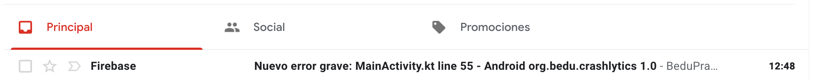

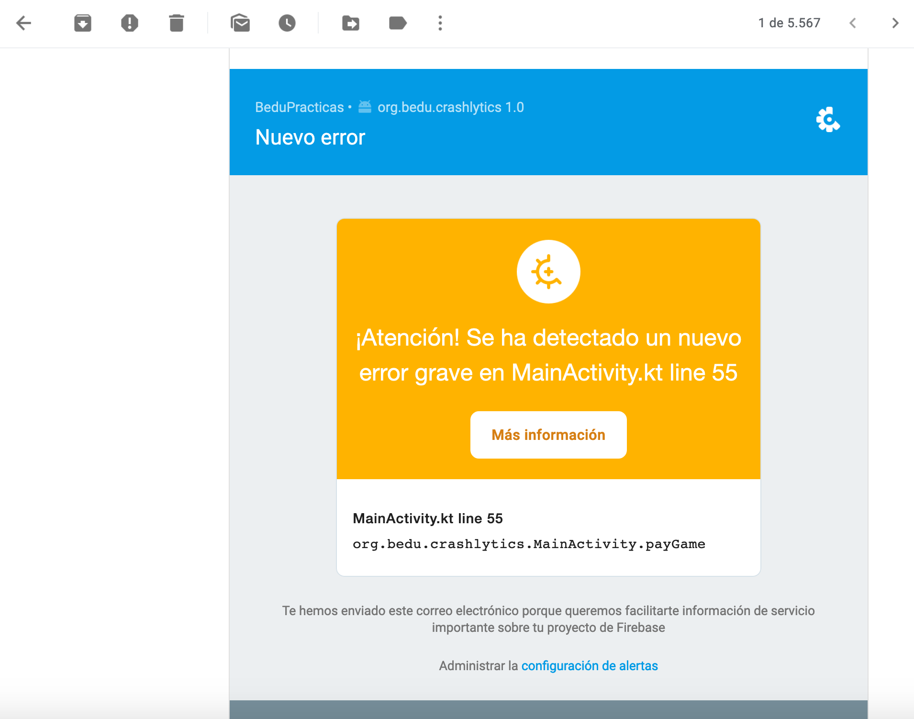

##### Estados de incidencias

Ahora vamos a modificar los estados de incidencias de errores, agregar notas y filtrarlos

1. En el menú de Crashlytics, visualizar y clickar el filtro de *Problemas*.

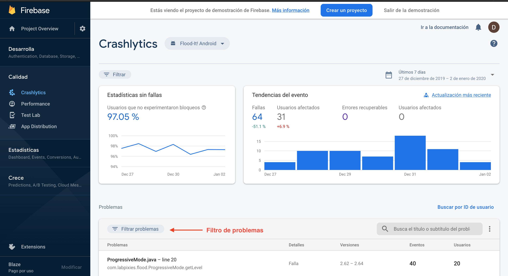

2. En las opciones, enfocar *Estado de la incidencia*, se muestran tres opciones con cuatro estados

* Abiertas
* Cerradas
* Silenciadas
* Datos

Vamos a manipular al menos tres de esos estados.

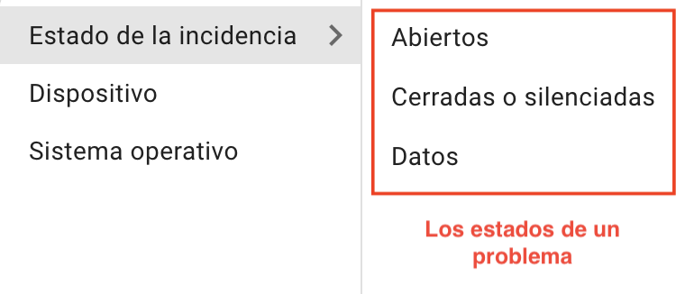

3. Abrimos cualquier problema Abierto (no dicce ni cerrado ni silenciado y no se muestra opaco)

4. en la siguiente página, buscar el botón azul *cerrar*, y dar click a la flecha hacia abajo, aquí está la opción para cambiar a silenciado o cerrado un problema.

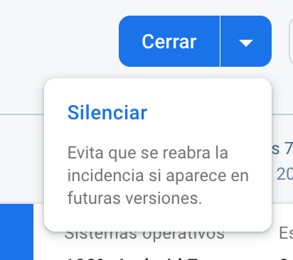

5. Cambiar a silenciado (el bicho capturado es azul)

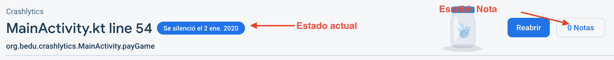

6. Agregar una nota,  deberá visualizarse de la siguiente forma:

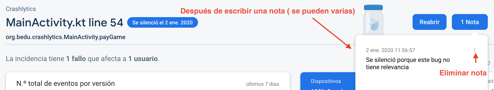

7. Cambiar a cerrado y agregar otra nota(el bicho capturado es verde con tapa roja)

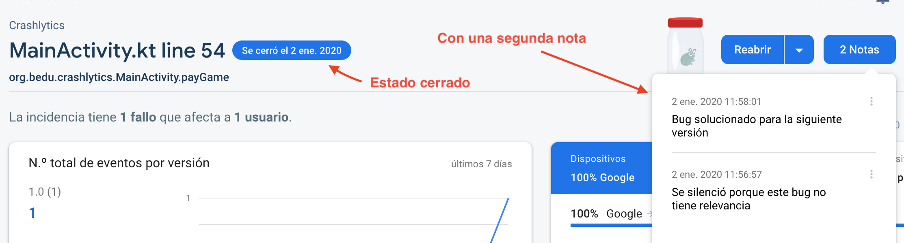

8. Regresar a la pantalla principal de Crashlytics. Modificar otra incidencia aplicar el filtro de *Cerradas o silenciadas*, se deben visualizar únicamente las que modificaste.

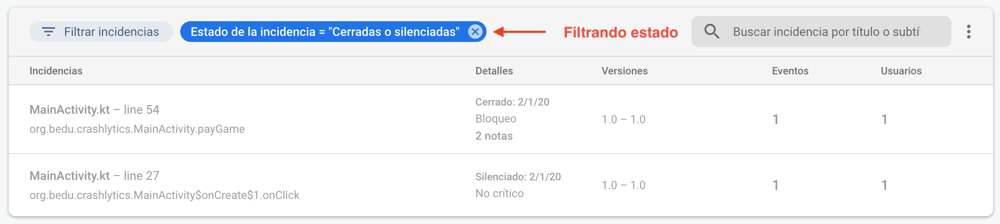

##### Alertas de velocidad y Configuración de datos de fallos

Si no deseas compartir la información de los crashes de tu app o quieres modificar el rango de tolerancia a incidencias repetidas por un periodo de tiempo, hay que abrir el DropDown menu en la esquina superior derecha del módulo de problemas.

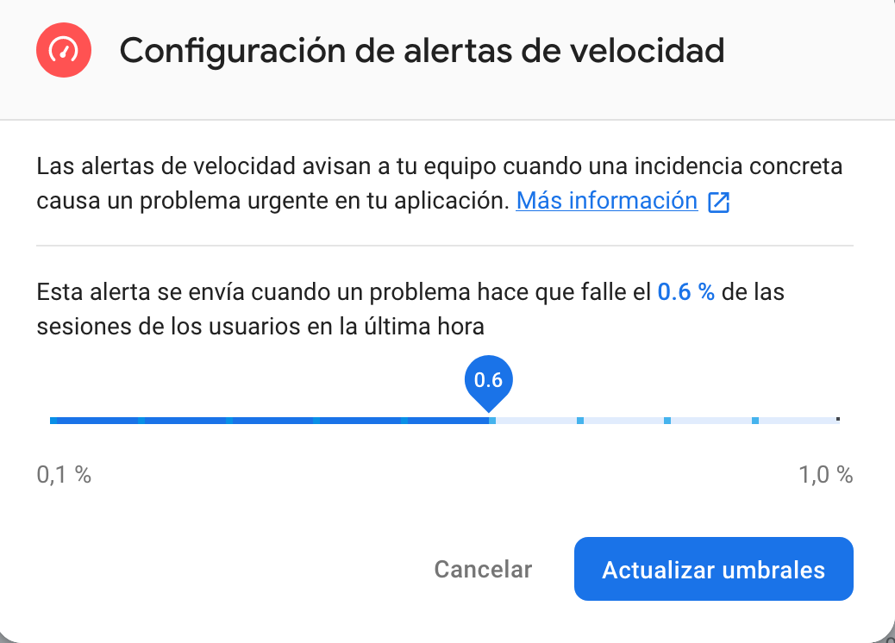

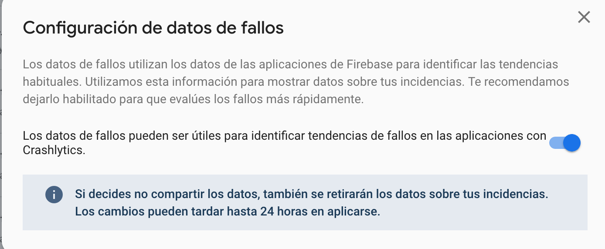

