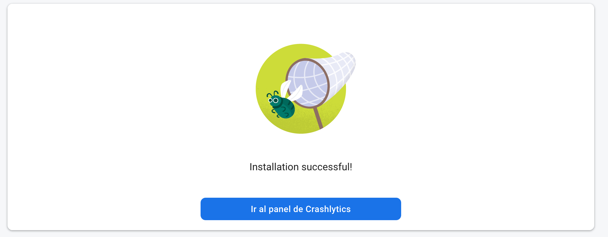
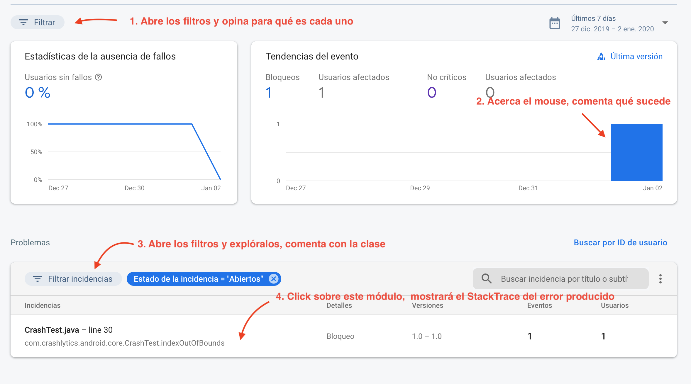
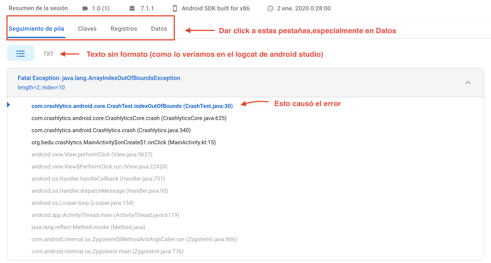
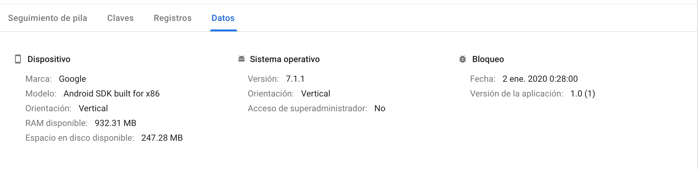
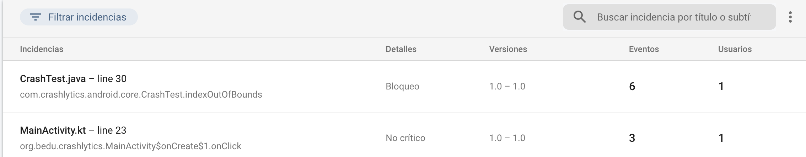
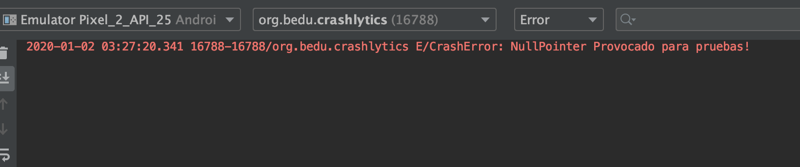
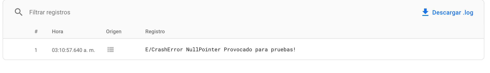

## Crashlytics - primeros pasos

### OBJETIVO 

- Comprender el panel de crashlytics
- Explorar un poco más el SDK de crashlytics

#### REQUISITOS 

1. Haber terminado el [Ejemplo 1](../Ejemplo-01)

#### DESARROLLO

En el ejemplo pasado, nuestra ventana había quedado así: 



- Al dar click sobre el botón, debe aparecer el siguiente panel, hacer todo lo que dice la imagen: 



- Al dar click al StackTrace, saldrá el siguiente panel, analizarlo y explorar las pestañas



- La última pestaña son datos del dispositivo que tuvo los errores



- La pestaña de registros corresponde a logs que se imprimen desde la aplicación por medio del comando: 

```kotlin
Crashlytics.log(priority: Int ,tag: String,msg:  String)//Hace un println (se muestra en el logcat) y registra el log en Crashlyticcs

CrashLytics.log(ms: String)//De esta forma sólo se reporta el log
```

- Implementar los siguientes métodos:

```kotlin
Crashlytics.log(Log.ERROR, "CrashError", "NullPointer Provocado para pruebas!")
```

provocando con un NullPointerException un error

```kotlin
try {
	throw NullPointerException()
    }
```

<details>
	<summary>Solucion<summary/>
		
```kotlin
 btnError.setOnClickListener{
            try {
                throw NullPointerException()
            } catch (ex: NullPointerException) {
                Crashlytics.log(Log.ERROR, "CrashError", "NullPointer Provocado para pruebas!")
            }
        }
```
	
</details>

***Nota: crashlytics guarda máximo 64kb del log en memoria para evitar realentamiento en la app***

***Nota 2: Los errores pueden tardar hasta 5 minutos en aparecer, tener paciencia si no aparece rápido***

En el dashboard, se deben ver reflejadas las tareas de la siguiente forma: 



Como ya no se usa el error provocado por Crashlytics, sino un NullPointerException provocado por nosotros, ahora se muestra que el origen del error fue en *MainActivity.kt*. Notamos también que dice *No crítico* (son errores que se cachan en un try catch)





Tanto en el logcat como en el registro aparece el error log que escribimos.


