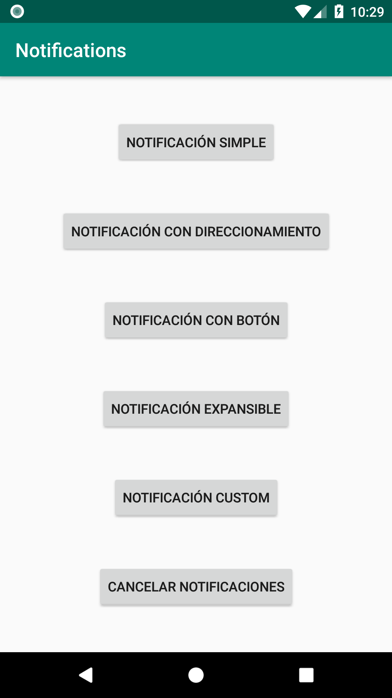
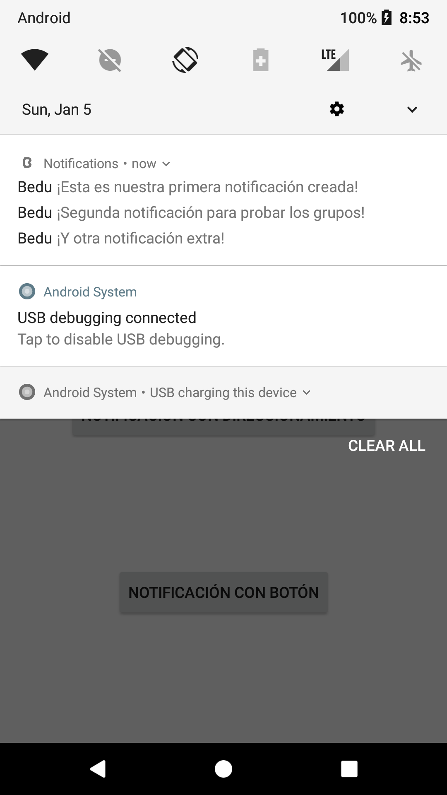
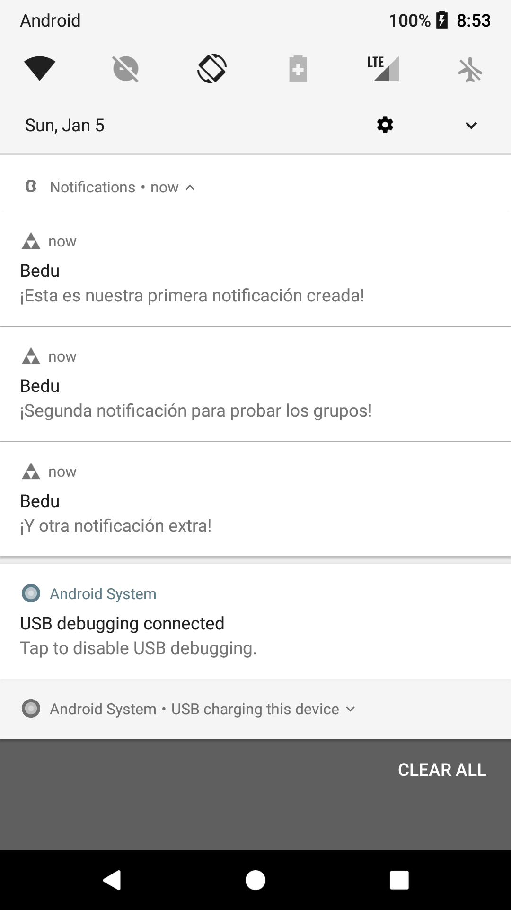
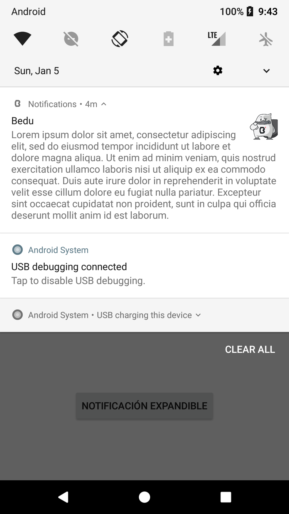
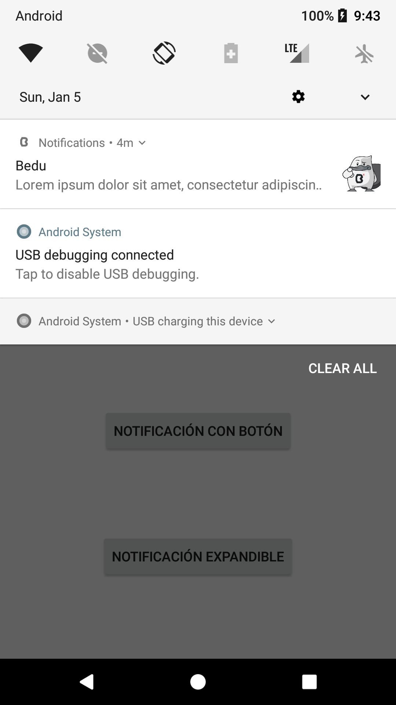
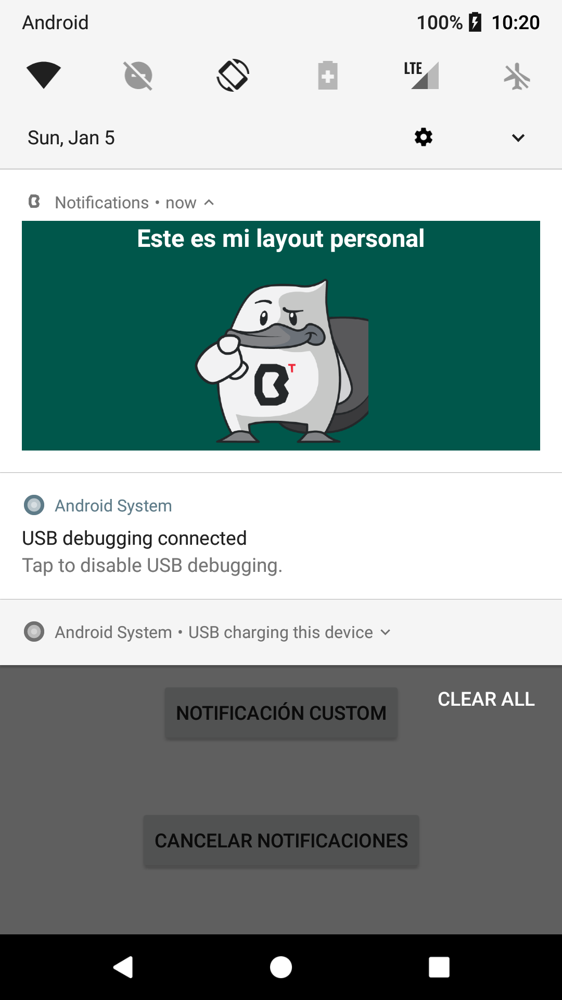
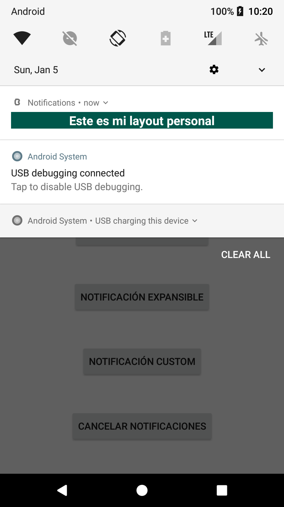

agrega el programa que se desarrollara con backticks> [agrega la sesion con backticks]

## Notificaciones Avanzadas

### OBJETIVO

- Enriquecer nuestro conocimiento de notificaciones con nuevos conceptos

#### REQUISITOS

1. Haber cursado el primer tema de esta sesión, incluído el [Ejemplo 1](../Ejemplo-01) y el [Reto 1](../Reto-01)

#### DESARROLLO

Estaremos utilizando el proyecto del [Reto 1](../Reto-01) como base 

1.- Agregaremos unos botones a nuestro menú, quedando el layout así: 

```xml
<?xml version="1.0" encoding="utf-8"?>
<androidx.constraintlayout.widget.ConstraintLayout xmlns:android="http://schemas.android.com/apk/res/android"
    xmlns:app="http://schemas.android.com/apk/res-auto"
    xmlns:tools="http://schemas.android.com/tools"
    android:layout_width="match_parent"
    android:layout_height="match_parent"
    tools:context=".MainActivity">

    <Button
        android:id="@+id/btnNotify"
        android:layout_width="wrap_content"
        android:layout_height="wrap_content"
        android:text="Notificación simple"
        app:layout_constraintBottom_toTopOf="@id/btnActionNotify"
        app:layout_constraintLeft_toLeftOf="parent"
        app:layout_constraintRight_toRightOf="parent"
        app:layout_constraintTop_toTopOf="parent" />

    <Button
        android:id="@+id/btnActionNotify"
        android:layout_width="wrap_content"
        android:layout_height="48dp"
        android:text="Notificación con direccionamiento"
        app:layout_constraintBottom_toTopOf="@id/btnNotifyWithBtn"
        app:layout_constraintLeft_toLeftOf="parent"
        app:layout_constraintRight_toRightOf="parent"
        app:layout_constraintTop_toBottomOf="@id/btnNotify" />

    <Button
        android:id="@+id/btnNotifyWithBtn"
        android:layout_width="wrap_content"
        android:layout_height="48dp"
        android:text="notificación con botón"
        app:layout_constraintBottom_toTopOf="@id/btnExpandable"
        app:layout_constraintLeft_toLeftOf="parent"
        app:layout_constraintRight_toRightOf="parent"
        app:layout_constraintTop_toBottomOf="@id/btnActionNotify" />

    <Button
        android:id="@+id/btnExpandable"
        android:layout_width="wrap_content"
        android:layout_height="48dp"
        android:text="notificación expansible"
        app:layout_constraintBottom_toTopOf="@id/btnCustom"
        app:layout_constraintLeft_toLeftOf="parent"
        app:layout_constraintRight_toRightOf="parent"
        app:layout_constraintTop_toBottomOf="@id/btnNotifyWithBtn" />

    <Button
        android:id="@+id/btnCustom"
        android:layout_width="wrap_content"
        android:layout_height="48dp"
        android:text="notificación Custom"
        app:layout_constraintBottom_toTopOf="@id/btnCancelNoti"
        app:layout_constraintLeft_toLeftOf="parent"
        app:layout_constraintRight_toRightOf="parent"
        app:layout_constraintTop_toBottomOf="@id/btnExpandable" />

    <Button
        android:id="@+id/btnCancelNoti"
        android:layout_width="wrap_content"
        android:layout_height="48dp"
        android:text="cancelar notificaciones"
        app:layout_constraintBottom_toBottomOf="parent"
        app:layout_constraintLeft_toLeftOf="parent"
        app:layout_constraintRight_toRightOf="parent"
        app:layout_constraintTop_toBottomOf="@id/btnCustom" />


</androidx.constraintlayout.widget.ConstraintLayout>
```



2. Crearemos grupos de notificaciones, para esto, comenzaremos asignando un string como id en nuestro MainActivity 

```kotlin
val GRUPO_SIMPLE = "GRUPO_SIMPLE"
```

3. En *strings.xml*, agregamos nuevos títulos y cuerpos para las nuevas notificaciones del grupo

```xml
<string name="simple_title_2">Bedu</string>
<string name="simple_body_2">¡Segunda notificación para probar los grupos!</string>

<string name="simple_title_3">Bedu</string>
<string name="simple_body_3">¡Y otra notificación extra!</string>
```

4. Agregamos un nuevo método ****setGroup()*** con el id del grupo en nuestro builder de notificación simple 
```kotlin
    var builder = NotificationCompat.Builder(this, CHANNEL_OTHERS)
            ...
            .setGroup(GRUPO_SIMPLE)
```

5. En nuestra función simpleNotification agregaremos otras dos notificaciones con el mismo grupo pero diferente contenido

```kotlin
var builder2 = NotificationCompat.Builder(this, CHANNEL_OTHERS)
            .setSmallIcon(R.drawable.triforce) //seteamos el ícono de la push notification
            .setColor(getColor(R.color.triforce)) //definimos el color del ícono y el título de la notificación
            .setContentTitle(getString(R.string.simple_title_2)) //seteamos el título de la notificación
            .setContentText(getString(R.string.simple_body_2)) //seteamos el cuerpo de la notificación
            .setPriority(NotificationCompat.PRIORITY_DEFAULT) //Ponemos una prioridad por defecto
            .setGroup(GRUPO_SIMPLE)

        var builder3 = NotificationCompat.Builder(this, CHANNEL_OTHERS)
            .setSmallIcon(R.drawable.triforce) //seteamos el ícono de la push notification
            .setColor(getColor(R.color.triforce)) //definimos el color del ícono y el título de la notificación
            .setContentTitle(getString(R.string.simple_title_3)) //seteamos el título de la notificación
            .setContentText(getString(R.string.simple_body_3)) //seteamos el cuerpo de la notificación
            .setPriority(NotificationCompat.PRIORITY_DEFAULT) //Ponemos una prioridad por defecto
            .setGroup(GRUPO_SIMPLE)
```

6. Creamos una nueva notificación, esta será la que agrupe a las otras dos notificaciones, el método setter *setGroupSummary(true)* hace que esta notificación sea de agrupaación. Esta es la forma más sencilla pero se pueden agregar más detalles al grupo. **NOTA: para versiones menores a API 24, se necesitan pasos adicionaales, ver más en la documentación**

```kotlin
 val summaryNotification = NotificationCompat.Builder(this@MainActivity, CHANNEL_OTHERS)
            .setSmallIcon(R.drawable.bedu_icon)
            .setGroup(GRUPO_SIMPLE)
            .setGroupSummary(true)
            .build()
```
y lanzamos las tres notificaciones y el agrupador

```kotlin
with(NotificationManagerCompat.from(this)) {
            notify(20, builder.build())
            notify(21, builder2.build())
            notify(22, builder3.build())
            notify(23, summaryNotification)
        }
```

El grupo colapsado debe verse así:



y Expandido:



7. Crearemos ahora una notificación expansible para cuando un texto es muy grande para el tamaño default de una notificación. Para ello asignamos el estilo del builder con **setStyle** y dentro del método declaramos el texto largo ccon *bigText(texto)*
```kotlin
    private fun expandableNotification(){

        var notification = NotificationCompat.Builder(this, CHANNEL_OTHERS)
            .setSmallIcon(R.drawable.bedu_icon)
            .setContentTitle(getString(R.string.simple_title))
            .setContentText(getString(R.string.large_text))
            .setLargeIcon(getDrawable(R.drawable.bedu)?.toBitmap()) //ícono grande a la derecha
            .setStyle(NotificationCompat.BigTextStyle() //este estilo define al expandible
                .bigText(getString(R.string.large_text))) //Cuerpo de la notificación cuando se expande
            .build()

        with(NotificationManagerCompat.from(this)) {
            notify(50, notification)
        }

    }

```

Asignamos el método al botón correspondiente. 

Esta es la notificación expandida


Esta es la notificación colapsada



8. Ahora crearemos una notificación con contenido definido por un Layout personalizado. Creamos un layout para el modo colapsado y otro para el expandido: 

para colapsado: 
```xml
<?xml version="1.0" encoding="utf-8"?>
<LinearLayout
    xmlns:android="http://schemas.android.com/apk/res/android"
    android:orientation="vertical"
    android:gravity="center"
    android:background="@color/colorPrimaryDark"
    android:layout_width="match_parent"
    android:layout_height="match_parent">
    <TextView
        android:text="Este es mi layout personal"
        android:textColor="#FFF"
        android:textSize="18sp"
        android:textStyle="bold"
        android:layout_width="wrap_content"
        android:layout_height="wrap_content"
        />

</LinearLayout>
```

para expandido:
```xml
<?xml version="1.0" encoding="utf-8"?>
<LinearLayout
    xmlns:android="http://schemas.android.com/apk/res/android"
    android:orientation="vertical"
    android:gravity="center"
    android:background="@color/colorPrimaryDark"
    android:layout_width="match_parent"
    android:layout_height="match_parent">
    <TextView
        android:text="Este es mi layout personal"
        android:textColor="#FFF"
        android:textSize="18sp"
        android:textStyle="bold"
        android:layout_width="wrap_content"
        android:layout_height="wrap_content"
        />
    <ImageView
        android:scaleType="fitCenter"
        android:layout_width="128dp"
        android:layout_height="128dp"
        android:src="@drawable/bedu"
        android:layout_marginTop="16dp"
        />

</LinearLayout>
```
9. Creamos nuestra función para lanzar nuestra notificación

```kotlin
private fun customNotification(){
        
        //obtenemos los layouts por medio de RemoteViews
        val notificationLayout = RemoteViews(packageName, R.layout.notification_custom)
        val notificationLayoutExpanded = RemoteViews(packageName, R.layout.notification_custom_expanded)


        var notification = NotificationCompat.Builder(this, CHANNEL_OTHERS)
            .setSmallIcon(R.drawable.bedu_icon)
            .setStyle(NotificationCompat.DecoratedCustomViewStyle()) //este estilo define que es personalizable
            .setCustomContentView(notificationLayout) //contenido en modo colapsado
            .setCustomBigContentView(notificationLayoutExpanded) //contenido en modo expandido
            .build()

        with(NotificationManagerCompat.from(this)) {
            notify(60, notification)
        }

    }
```

y lo asignamos al listener de su botón

La vista expandida se ve así:


y contraída: 



10. Por último, creamos la función para cancelar todas las notificaciones

```kotlin

 private fun cancelNotifications(){
        with(NotificationManagerCompat.from(this)) {
            cancelAll()
        }
    }
    
 ```
 
 la asignamos al listener de su botón respectivo. Corremos la app, abrimos un par de notificaciones y presionamos el botón.


