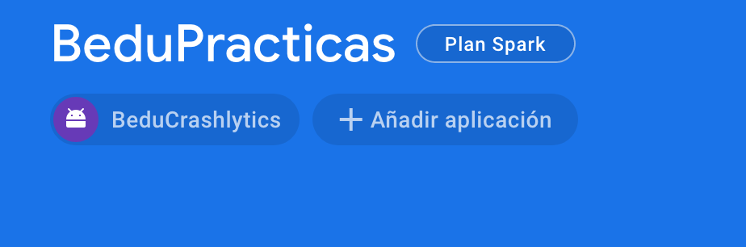
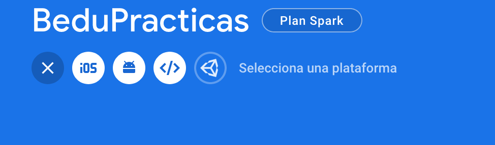
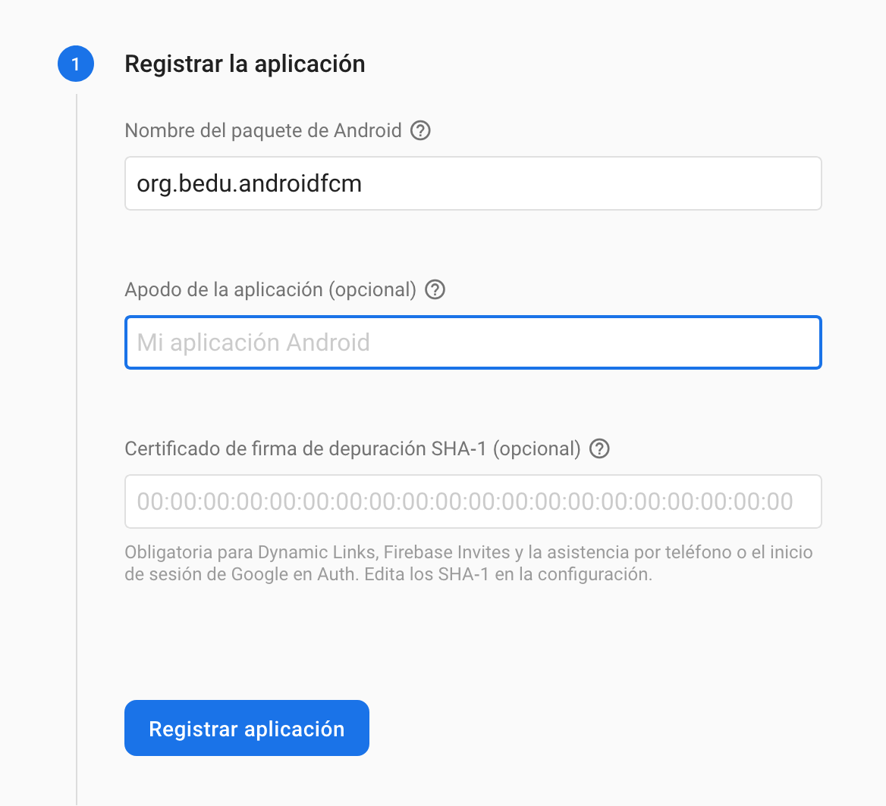
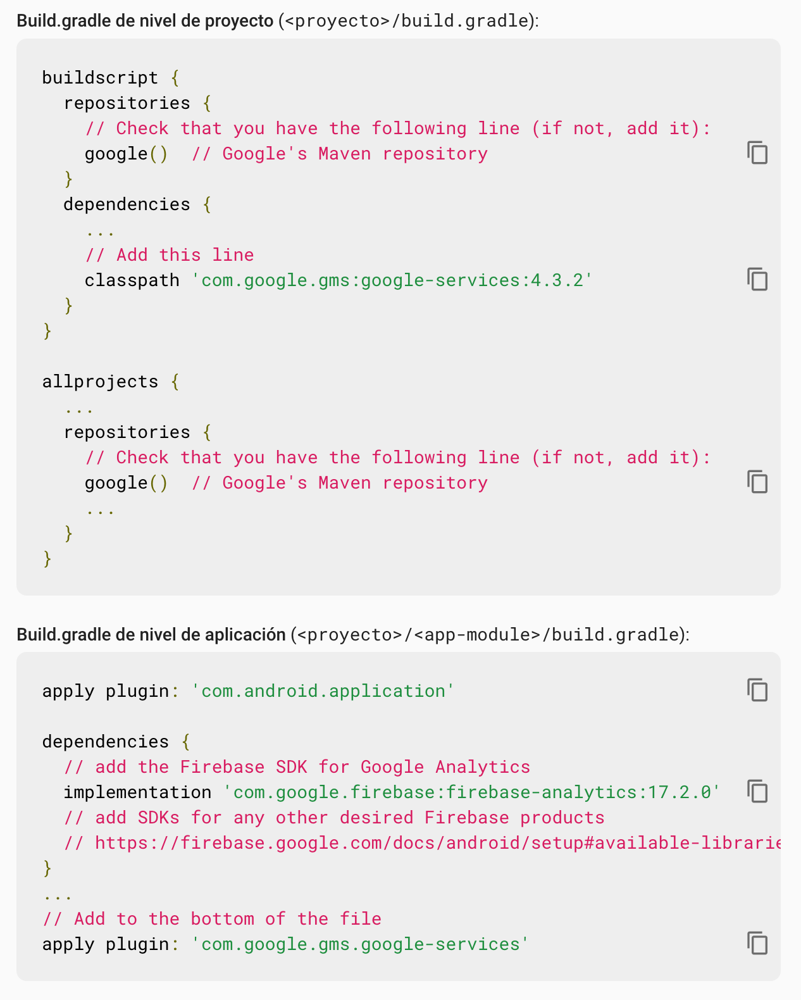
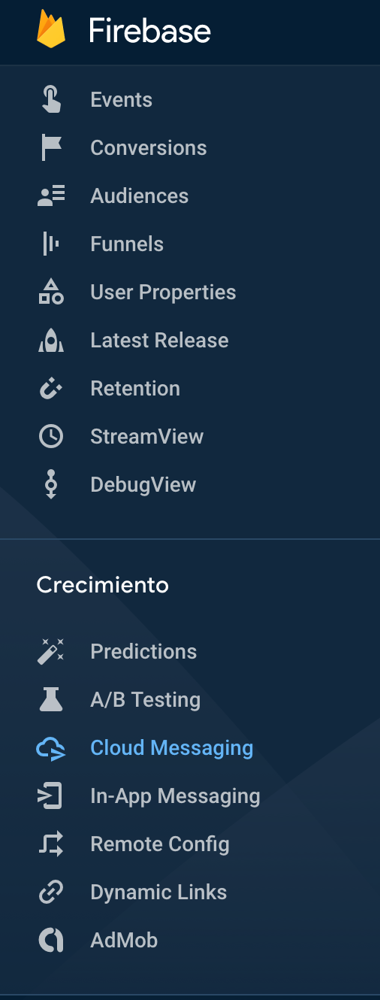
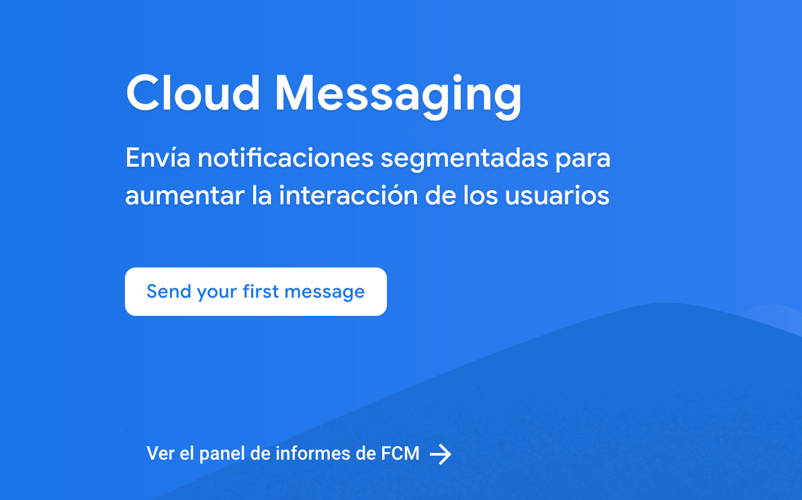
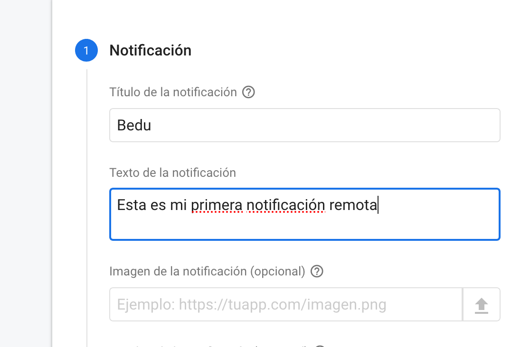
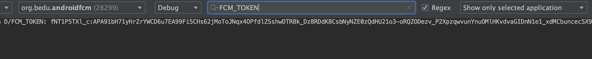
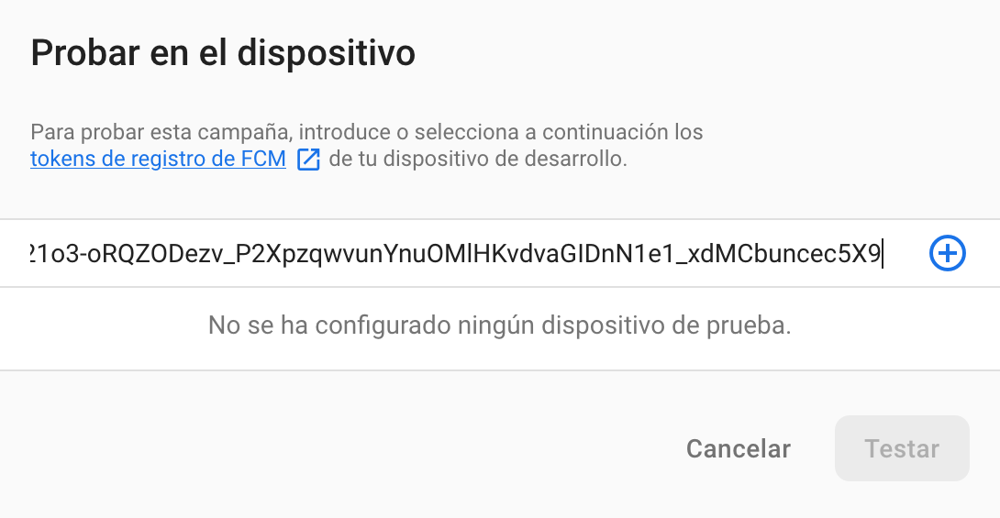
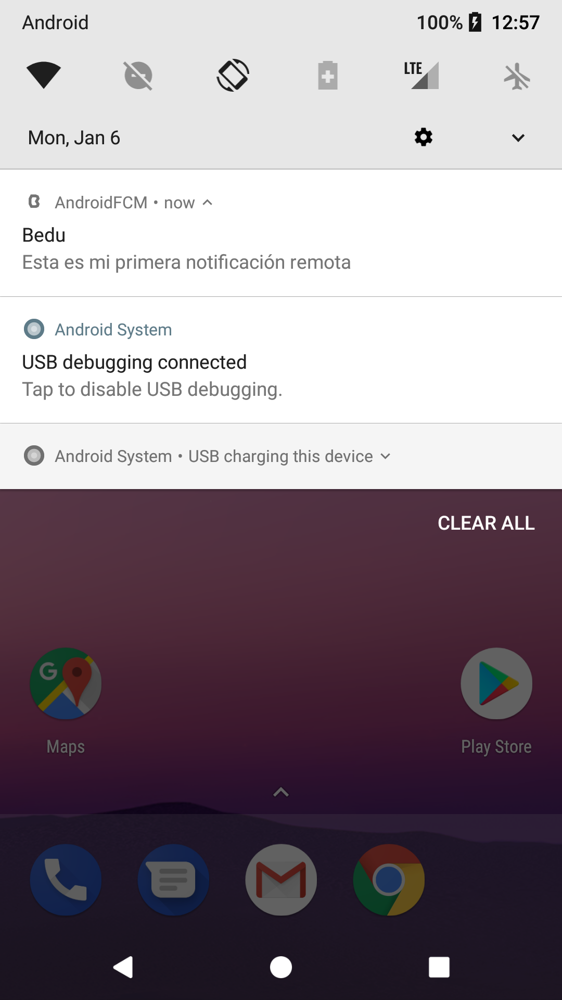

## Notificaciones y FCM

### OBJETIVO

- Instalar y utilizar el SDK de Firebase Message Cloud para el uso de push notifications

#### REQUISITOS

1. Haber cursado los temas previos sobre notificaciones
2. Leer todo lo relacionado a FCM en el prework

#### DESARROLLO

Vamos a instalar la SDK de FCM Para android, y después la utilizaremos. Para ello, hay que configurar la aplicación en nuestro proyecto de Firebase (creado previamente en la [Sesión 5](../../Sesión-05) ), en el [Ejemplo 1](../../Sesion-05/Ejemplo-01) para ser exactos.

a) En la pantalla de inicio del proyecto, click la opción *Añadir aplicación* y al ícono de android





b) Registrar el nombre del paquete de la aplicación y su nickname



c) Descargar el archivo *google-services.json* y moverlo a la carpeta app del proyecto, como se indica en la imagen


***Opcional:*** *el paso de comprobación puede ser saltado*

d) Instalar las dependencias, tal cual se muestra en las instrucciones y sincroniza el proyecto.



**¡LISTO!** Ya tienes firebase en tu proyecto.


1. Agregar la dependencia en gradle de FCM

```kotlin
implementation 'com.google.firebase:firebase-messaging:20.0.0'
```

2. Creamos un clase que extienda de FirebaseMessagingService e Incluimos el servicio de FCM como service en el Manifiesto de nuestra aplicación, esto nos servirá posteriormente para nuestro [Reto 3](../Reto-03)

```kotlin
class FirebaseMessaging: FirebaseMessagingService() {

}
```

```xml
 <service
            android:name=".FirebaseMessaging"
            android:exported="false">
            <intent-filter>
                <action android:name="com.google.firebase.MESSAGING_EVENT" />
            </intent-filter>
        </service>
```

3. Agregar el ícono bedu_icon del proyecto anterior a *drawable*. En el manifest pondremos estas líneas para agregaar un ícono si desde el servicio no se define uno, al igual que el otro metadata para notification channels.

```xml
<meta-data
    android:name="com.google.firebase.messaging.default_notification_icon"
    android:resource="@drawable/bedu_icon" />
<meta-data
    android:name="com.google.firebase.messaging.default_notification_channel_id"
    android:value="DEFAULT_CHANNEL" />
```

4. En el *onCreate* del *MainActivity*, obtener el token FCM de nuestro dispositivo cliente e imprimirlo en el log (para pruebas).

```kotlin
 FirebaseInstanceId.getInstance().instanceId
            .addOnCompleteListener(OnCompleteListener { task ->
                if (!task.isSuccessful) {
                    Log.w("ERROR_FCM", "getInstanceId failed", task.exception)
                    return@OnCompleteListener
                }

                // Get new Instance ID token
                val token = task.result?.token

                Log.d("FCM_TOKEN",token)

                //toast
                Toast.makeText(baseContext,"FCM token: $token", Toast.LENGTH_SHORT).show()
            })
```


5. Ejecutaremos una prueba de notificación desde nuestra consola Firebase. En la barra lateral del menú principal, click a la opción *CloudMessaging*.



6. Click en ***Send your first message***



6. Escribir el título y el contenido de nuestra notificación.



7. Correr la aplicación, copiar el token como viene en el logcat (Filtrar el resultado del logcat con el Tag *FCM_TOKEN*) y cerrar la app.



8. Dar click en *Enviar mensaje de prueba*

9. Ingresar el token copiado en la ventana, agregarlo y pulsar Test. **Nota: Importante cerrar la app o minimizarla**


10. Recibirán una notificación como esta: 



