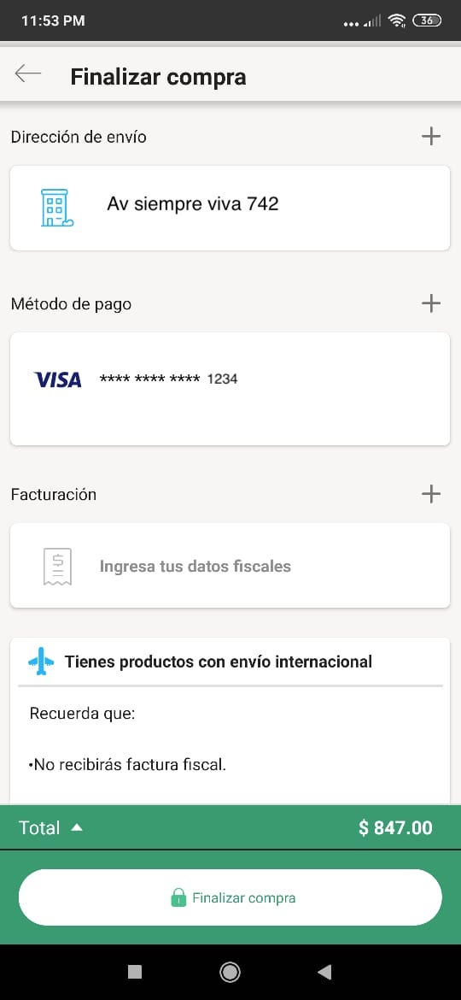
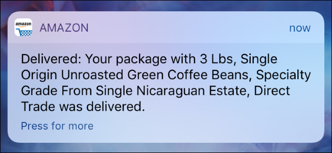

## Postwork

### OBJETIVO

- Implementar el servicio de notificaciones al pagar el carrito de compras

#### REQUISITOS

1. Lo necesario para desarrollar el ejemplo o el Reto

#### DESARROLLO

Para este módulo, será necesario crear el flujo de pago de los productos en el carrito de compras.

Crearemos la pantalla de pago y el botón de confirmar pago, el cual simulará la compra y detonará que recibamos una notificación indicando que nuestra compra se ha realizado y se muestre una lista de los productos comprados.

Este es un ejemplo de pantalla de pago

y este es un ejemplo de push notification de un producto entragado por amazon que puede ser la base de la push a generar.

