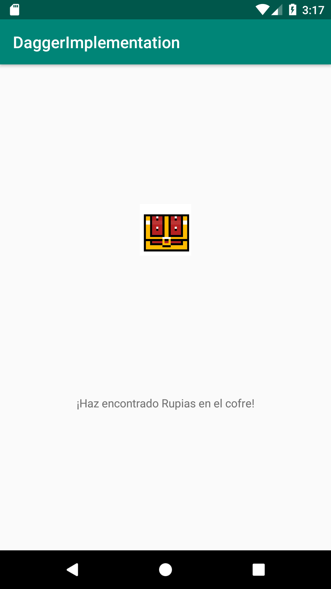

## Inyección de dependencias

### OBJETIVO

- Que el usuario comprenda a través de este ejemplo el concepto de DI y sus implicaciones

#### REQUISITOS

1. Leer el enlace al tema homónimo y de Dagger en el Prework

#### DESARROLLO


1. Instalamos Dagger 2

```kotlin
 implementation 'com.google.dagger:dagger:2.25.2'
    api 'com.google.dagger:dagger-android-support:2.25.2'
    kapt 'com.google.dagger:dagger-compiler:2.25.2'
```

2. Ponemos en el layout un textView con id *textView* y un ImageView con id *chest*, agregamos la imagen ***chest.png*** que está en este proyecto

3. Buscamos inyectar cierta información en nuestra actividad, para esto, en el MainActivity creamos esta clase:

```kotlin
class Secret(){
    val hint = "¡Haz encontrado Rupias en el cofre!"
}
```

y declaramos nuestra variable *secret* en la Actividad:

```kotlin
lateinit var secret: Secret
```

4. Intentamos pasar una instancia de esta clase al *MainActivity*, para evitar crearla desde adentro.

```kotlin
class MainActivity : AppCompatActivity(val secret:Secret) {...
```
Intentemos compilar, ¿Qué sucede? No se puede pasar el parámetro en el constructor. Esa es una de las razones por la que se creó Dagger, para facilitar la inyección de dependencias en Activities y Fragments. Eliminemos el parámetro de la actividad.

5. Vamos a crear nuestro Componente Dagger, que va a ser el encargado de inyectar la dependencia

```kotlin
@Component
interface SecretComponent {
    fun inject(app: MainActivity)
}
```

el componente se crea por una Interfaz, ya que Dagger crea el objeto en tiempo de compilación (Veremos luego el objeto generado).

6. Como la clase Secret es la que se tiene que inyectar, agregamos la anotación @Inject, seguido de su constructor (así sabe Dagger qué inyectar).

```kotlin
class Secret @Inject constructor(){
    val hint = "¡Haz encontrado Rupias en el cofre!"
}
```

7. Ya tenemos qué inyectar, ahora ¿En dónde inyectamos? exacto, en la variable miembro de *MainActivity*, por lo cual utilizamos la misma anotación:

```kotlin
 @Inject
    lateinit var secret: Secret
```

8. Después de SetContentView, agrega esta línea de código:
```kotlin
DaggerSecretComponent.create().inject(this)
```

Al compilar se generará la clase llamada arriba, tomando el nombre de la interfaz previaamente definida y poniendo como prefijo, la palabra *Dagger*, de esta forma: ***Dagger<NombreDelComponente>***
 
 9. Ahora sólo queda asignar el valor *hint* de nuestro Secreto al *textView* cuando el usuario de click en el cofre.
 
 Debe quedar al final algo así: 
 
 


